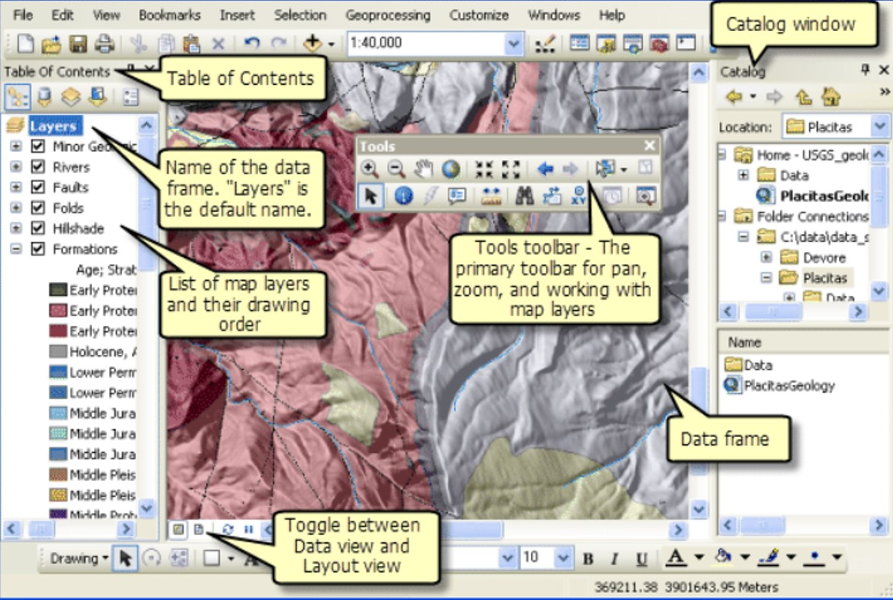
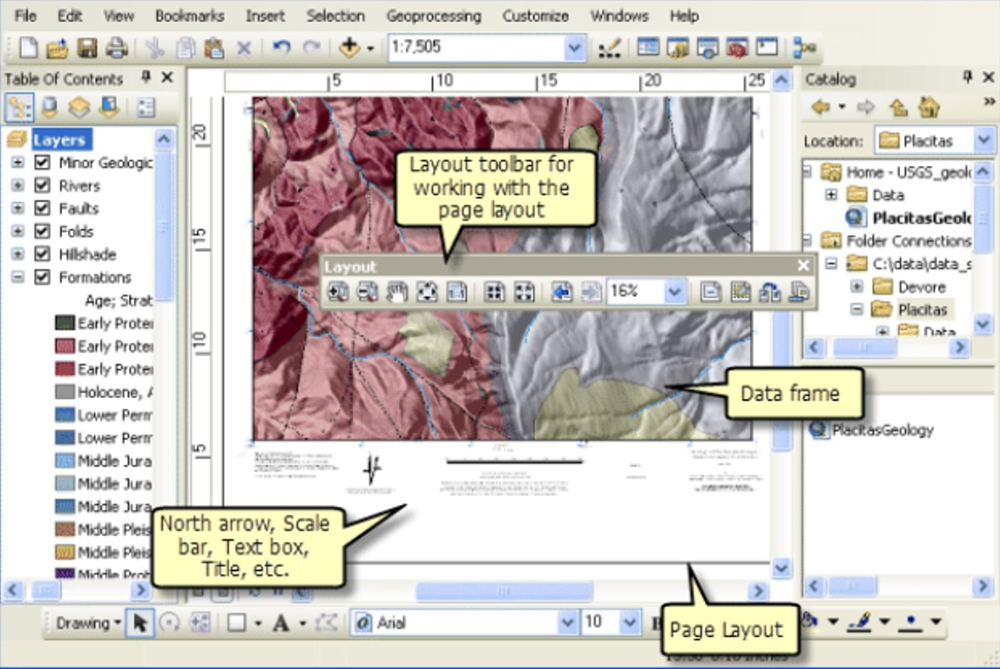
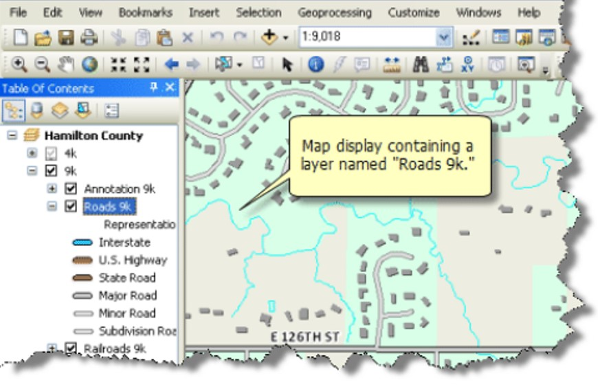
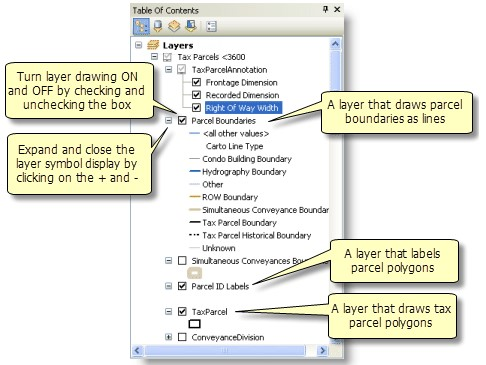
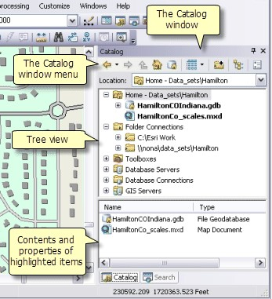

# Lingkungan Kerja ArcMap

Perangkat lunak ArcMap merepresentasikan informasi geografis dengan kumpulan sebuah lapisan \(layer\) dan elemen lain pada sebuah tampilan peta. Ada dua tampilan peta utama, yaitu: data view dan layout view. Data frame berisi sebuah jendela geografis atau disebut map frame yang berfungsi untuk menampilkan dan mengolah informasi geografis dari berbagai jenis map layers. Pada layout view terdapat page view, yang berfungsi untuk mengolah elemen peta \(seperti data frame, scale bar, judul peta\) yang disusun berdasarkan lapisan untuk mengatur peta dalam bentuk cetak \(printing\).

Tampilan peta di ArcMap bisa dibagi menjadi dua, yaitu:

1. Data view
2. Layout view

Setiap view tersebut berisi data yang ada dalam peta, sehingga dapat diolah sesuai keinginan kita. Di dalam data view terdapat sebuah peta, yang disebut juga dengan data frame. Data frame berisi informasi geografis yang terdiri dari berbagai lapisan peta. Misalnya koordinat peta, judul, panah utara, skala, dan lainnya.

Jika kita ingin mencetak peta ke bentuk kertas atau mengeksportnya berupa PDF, dapat menggunakan format map layout. Format ini menampilkan dalam bentuk page layout.

### Map Layers

Di dalam data frame terdapat dataset atau sekumpulan data geografis yang direpresentasikan dengan layer. Setiap layer dapat berisi data dan informasi penting di dalam peta seperti:

1. Data diskrit berupa sekumpulan titik, garis, dan poligon;
2. Permukaan peta, seperti ketinggian yang direpresentasikan dengan angka melalui garis kontur dan titik-titik ketinggian dalam bentuk relief; 
3. Foto citra satelit.

Contoh map layer pada gambar berikut berisi data sungai, danau, lahan, jalan, daerah administratif, bangunan, batas, dan gambar orthophoto.

### Table of Contents

Bagian ini menampilkan daftar layer \(lapisan\) pada peta dan menunjukkan fitur setiap layer-nya direpresentasikan. Tanda check box menunjukkan layer itu aktif atau tidak. Urutan layer menunjukkan bahwa urutan lapisan yang tergambar di peta atau data frame.

### Catalog

ArcMap, ArcGlobe, dan ArcScene termasuk ke dalam Catalog yang digunakan untuk memanajemen berbagai jenis informasi geografis seperti data, peta, hasil project GIS Anda ketika bekerja dengan ArcGIS.

Catalog berupa tampilan tree dari sekumpulan folder dan geodatabase. Folder digunakan untuk mengorganisasikan dokumen dan file ArcGIS Anda. Geodatabase digunakan untuk mengorganisasikan dataset GIS Anda.

