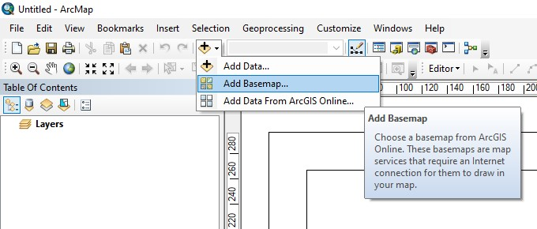
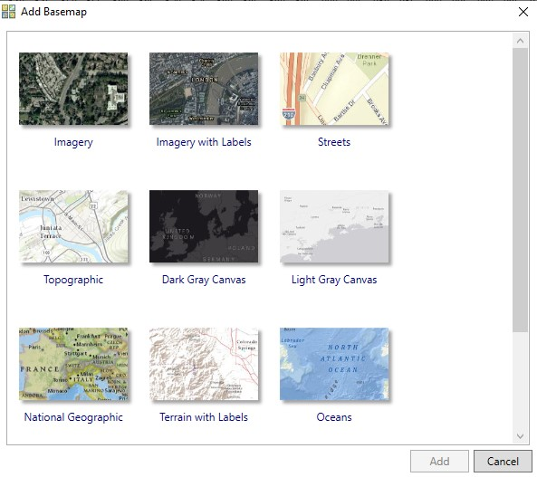
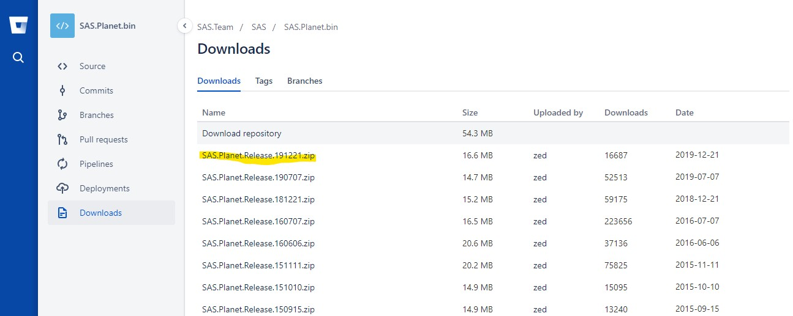
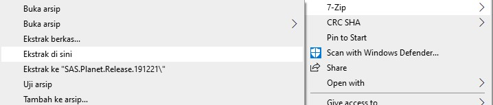
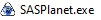
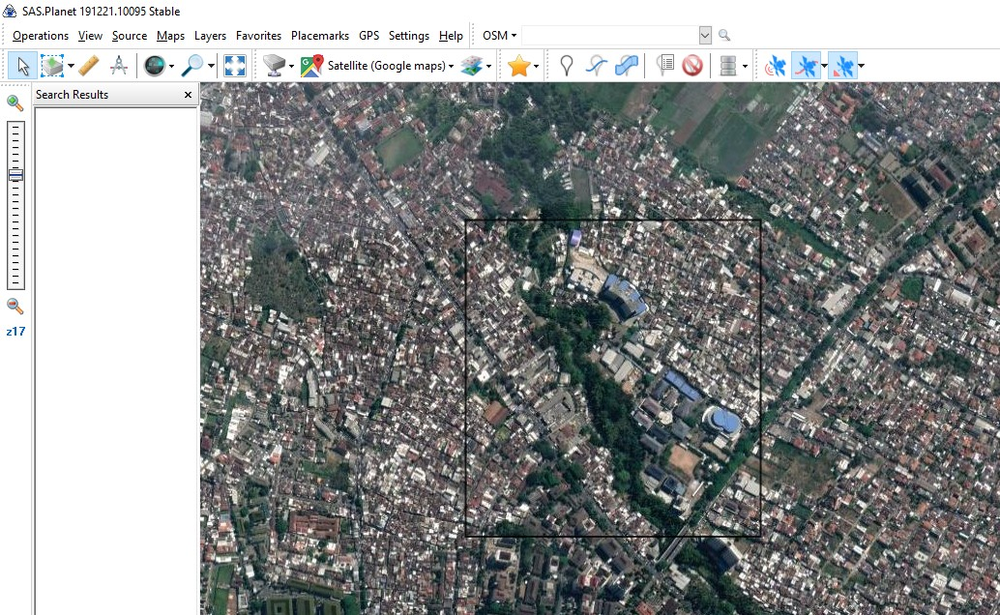
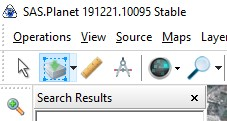
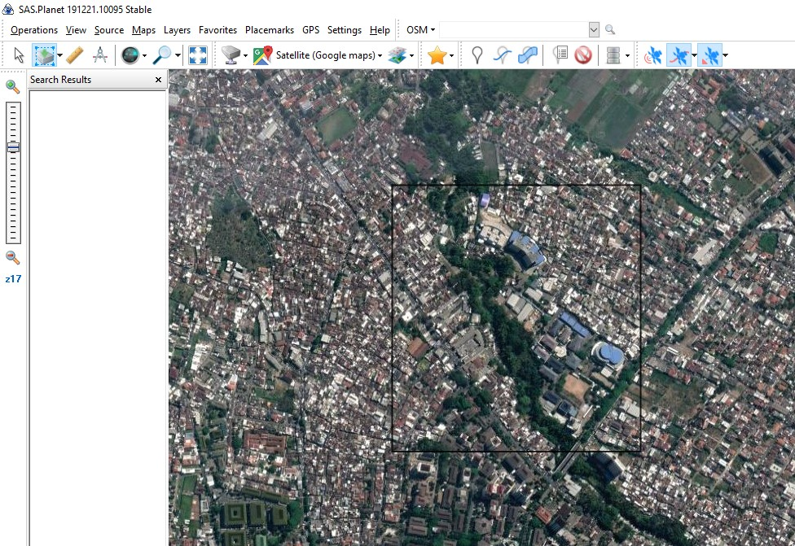
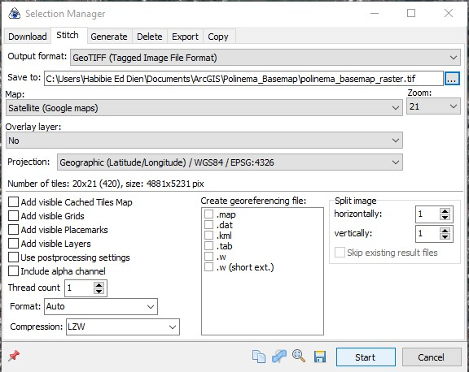
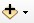

# Bab 2 Tutorial Editing

## Membuat Dokumen Peta Baru

Ada dua kondisi untuk membuat dokumen peta baru pada ArcMap, yaitu:

### Kondisi 1: Saat aplikasi ArcMap pertama kali dibuka

1. Tampilan saat ArcMap baru pertama kali dibuka seperti pada gambar berikut. 
2. Pilih **ISO \(A\) Page Sizes** kemudian klik **ISO A3 Landscape**.
3. Klik **OK** untuk membuat dokumen peta baru.

### Kondisi 2: Saat sedang bekerja menggunakan ArcMap

Pada kondisi ini, ada tiga cara untuk membuat dokumen peta baru, yaitu:



**Cara 1**: klik **File** &gt; **New**




Cara 2: klik pada icon **New**  




Cara 3: menekan tombol **Ctrl + N** pada keyboard



Dari ketiga cara tersebut, kemudian akan tampil kotak dialog untuk membuat dokumen peta baru seperti pada gambar berikut ini.

## Menambah Peta Dasar Secara Online

### Langkah 1


Pastikan koneksi internet stabil dan lancar saat ingin menambahkan peta dasar secara online


Pilih menu icon seperti pada gambar berikut ini. Lalu pilih **Add Basemap...**.

### Langkah 2

Maka akan tampil kotak dialog seperti pada gambar berikut ini. Misalnya di sini memilih **Imagery with Labels**. Kemudian klik tombol **Add** di pojok kanan bawah.

Tunggu proses memuat peta sampai selesai, maka akan muncul layer baru di bagian **Table of Contents**.

## Menambah Peta Dasar Secara Offline

Anda perlu memahami bahwa peta dasar merupakan jenis data raster hasil dari citra satelit. Foto raster memiliki kualitas berbeda berdasarkan tingkat _zoom_. Terkadang Anda membutuhkannya di ArcMap ketika koneksi internet tidak mendukung. Berikut langkah-langkah untuk mengunduh citra satelit secara gratis yang dapat disesuaikan dengan kebutuhan Anda.

### Langkah 1

Silakan unduh terlebih dahulu aplikasi SAS Planet dari [tautan ini](https://bitbucket.org/sas_team/sas.planet.bin/downloads).


**SAS Planet** adalah program untuk menampilkan dan sekaligus bisa dimanfaatkan untuk melakukan download image resolusi tinggi dari Google Map, Bing, Nokia, Yahoo, dan sebagainya.


### Langkah 2

Setelah proses unduhan selesai, Anda dapat mengekstraknya dengan aplikasi 7zip, WinZip, atau aplikasi bawaan sistem dengan mengklik kanan pada file hasil unduhan.

Lalu klik file  untuk menggunakan aplikasi tersebut.

### Langkah 3

Peringatan! Pastikan Anda memiliki koneksi internet yang cukup agar proses unduh peta dapat berjalan dengan lancar.

Pilih penyedia citra satelit, misalnya di sini menggunakan Google Maps Satellite.

Kemudian zoom in ke area kampus Polinema.

### Langkah 4

Pilih shift tool lalu buat area pemotongan foto satelit sesuai kebutuhan seperti pada gambar berikut.

Cara memotong citra satelit adalah klik kiri sekali, lalu geser mouse  sesuai besar area yang ingin dipotong, dan klik kiri sekali.

### Langkah 5

Kotak dialog **Selection Manager** akan muncul. Pilih tab **Stitch** &gt; pilih **Zoom** **21**.

**Output format:** Pilih **GeoTIFF \(Tagged Image File Format\)**

**Zoom:** 21

**Projection:** Geographic \(Latitude/Longitude\) / WGS84 / EPSG: 4326

Buat folder dan tentukan nama file citra, misalnya **polinema\_basemap\_raster.tiff**

Klik **Start** untuk memulai unduhan. Tunggu hingga proses unduhan selesai.

### Langkah 6

Ada dua cara untuk menambah peta dasar secara offline di ArcMap.



Cara 1 - Pilih icon  **Add Data** &gt; Pilih file **polinema\_basemap\_raster.tiff**



Cara 2 - Pilih dari jendela Catalog, lalu drag dan drop file **polinema\_basemap\_raster.tiff** ke Layers \(Table of Contents\).



Dari kedua cara tersebut, kemudian akan muncul kotak dialog untuk menentukan Sistem Koordinat. Misalnya pada pelatihan ini, kita akan menggunakan WGS UTM 49S. Alasannya, karena posisi Malang berada di 49S berdasarkan zona UTM Indonesia \(Anda dapat mencarinya di internet\). Alasan lain, nanti kita akan menggunakan satuan meter untuk proses digitasi.


Anda telah praktik membuat dokumen peta baru, menambah peta dasar secara online maupun offline di ArcMap.


