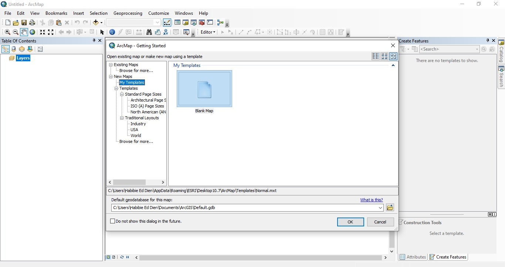
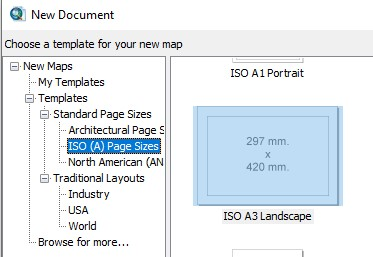
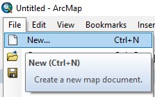
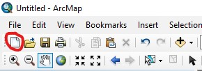
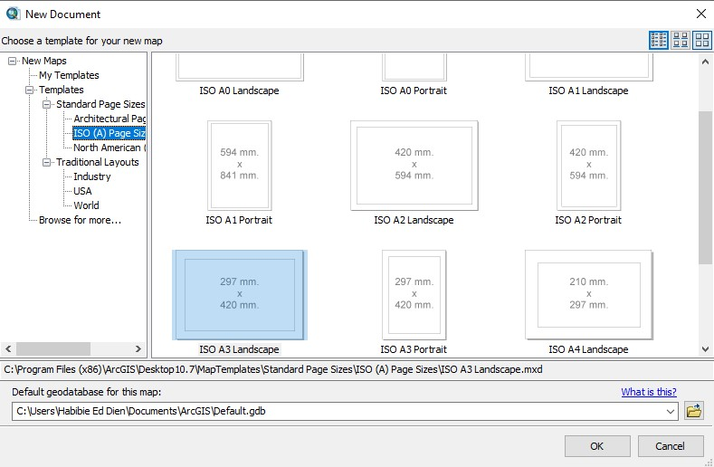

# Bab 2 Tutorial Editing

### Membuat Dokumen Peta Baru

Ada dua kondisi untuk membuat dokumen peta baru pada ArcMap, yaitu:

#### Kondisi 1: Saat aplikasi ArcMap pertama kali dibuka

1. Tampilan saat ArcMap baru pertama kali dibuka seperti pada gambar berikut. 
2. Pilih **ISO \(A\) Page Sizes** kemudian klik **ISO A3 Landscape**.
3. Klik **OK** untuk membuat dokumen peta baru.

#### Kondisi 2: Saat sedang bekerja menggunakan ArcMap

Pada kondisi ini, ada tiga cara untuk membuat dokumen peta baru, yaitu:



**Cara 1**: klik **File** &gt; **New**




Cara 2: klik pada icon **New**  




Cara 3: menekan tombol **Ctrl + N** pada keyboard



Dari ketiga cara tersebut, kemudian akan tampil kotak dialog untuk membuat dokumen peta baru seperti pada gambar berikut ini.

### Menambah Peta Dasar

