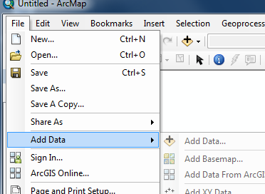
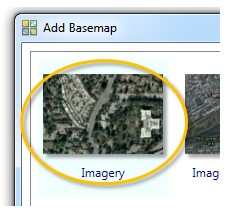
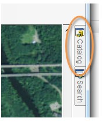
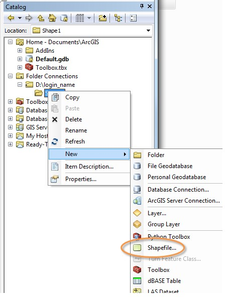

# 1a: Membuat Titik Baru

### Langkah 1: Persiapkan peta dasar Anda

Perhatikan bahwa cara terbaik untuk membuat shapefile adalah melalui ArcCatalog. Langkah-langkah berikut mengasumsikan bahwa Anda memiliki sesi ArcMap yang sudah terbuka dengan dokumen peta baru \(kosong\).

Anda akan menggunakan gambar latar belakang kampus Polinema untuk praktikum ini.

Klik **File** &gt; **Add Data** &gt; **Add Basemap...**

Selanjutnya, pilih **Imagery**.

Selanjutnya, _zoom in_ ke area kampus Polinema.

-- gambar kampus polinema --

### Langkah 2: Membuat titik baru dengan shapefile

Klik pada **tab ArcCatalog**

Di ArcCatalog, klik **kanan** pada folder project Anda, kemudian pilih **New** &gt; **Shapefile**.

Beri nama **LatihanTitik** dan ubah jenis fitur ke **Point**.

-- gambar penamaan point --

Selanjutnya menentukan sistem koordinat pada shapefile Anda. Pada latihan ini, kita menggunakan sistem koordinat ... 

Klik tombol **Edit...** kemudian pilih ...

Klik **OK** untuk menutup kotak dialog dan klik **OK** lagi pada kotak dialog shapefile.

### Langkah 3: Memulai proses editing

Klik kanan pada _layer LatihanTitik_ pada bagian **Table of contents**, pilih **Edit Features** &gt; **Start Editing**.

-- gambar 


Anda mungkin akan melihat kotak pesan peringatan bahwa layer yang akan diedit mungkin tidak sesuai dengan data frame. Klik **Continue** untuk mengabaikan pesan tersebut.

-- gambar


Tampilkan jendela **Create Features** dengan cara ... Melalui jendela ini Anda dapat memilih peralatan _editing_ berupa titik, poligon, elips, dan lain-lain.

Pilih **LatihanTitik** pada jendela **Create Features**.

-- gambar

### Langkah 4: Mengubah dari fitur titik ke polygon

xxx

