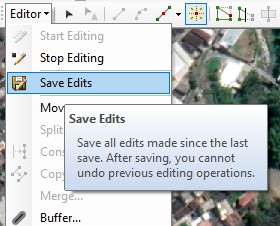

# 1a: Membuat Titik Baru

### Langkah 1: Persiapkan peta dasar Anda

Perhatikan bahwa cara terbaik untuk membuat shapefile adalah melalui ArcCatalog. Langkah-langkah berikut mengasumsikan bahwa Anda memiliki sesi ArcMap yang sudah terbuka dengan dokumen peta baru \(kosong\).

Anda akan menggunakan gambar latar belakang kampus Polinema untuk praktikum ini.

Klik **File** &gt; **Add Data** &gt; **Add Basemap...**

Selanjutnya, pilih **Imagery**.

Selanjutnya, _zoom in_ ke area kampus Polinema.

### Langkah 2: Membuat titik baru dengan shapefile

Klik pada **tab ArcCatalog**

Di ArcCatalog, klik **kanan** pada folder project Anda, kemudian pilih **New** &gt; **Shapefile**.

Beri nama **LatihanTitik** dan ubah jenis fitur ke **Point**.

Selanjutnya menentukan sistem koordinat pada shapefile Anda. Pada latihan ini, kita menggunakan sistem koordinat **GCS\_WGS\_1984**.

Klik tombol **Edit...** kemudian pilih **WGS 1984**.

Klik **OK** untuk menutup kotak dialog dan klik **OK** lagi pada kotak dialog shapefile.

### Langkah 3: Memulai proses editing

Klik kanan pada _layer LatihanTitik_ pada bagian **Table of contents**, pilih **Edit Features** &gt; **Start Editing**.


Anda mungkin akan melihat kotak pesan peringatan bahwa layer yang akan diedit mungkin tidak sesuai dengan data frame. Klik **Continue** untuk mengabaikan pesan tersebut.


Tampilkan jendela **Create Features** dengan cara klik icon  pada Editor toolbar. Melalui jendela ini Anda dapat memilih peralatan _editing_ berupa titik, poligon, elips, dan lain-lain.

Pilih **LatihanTitik** pada jendela **Create Features**.

Ketika proses editing selesai, Anda harus menyimpan shapefile baru Anda agar hasil pekerjaan tidak hilang, kemudian sesi editing dapat diakhiri seperti pada cara berikut:

Perhatikan pada bagian **toolbar Editor**, lalu klik **Editor** &gt; **Save Edits**,

kemudian klik **Editor** &gt; **Stop Editing**.


**Penting!** Silakan simpan hasil pekerjaan Anda sebelum sesi editing diakhiri atau sebelum membuat shapefile yang lain.


### Langkah 4: Mengubah jenis fitur Shapefile

Langkah untuk membuat shapefile berupa **polygon**, **polyline** atau **point** hampir sama. Perbedaannya hanya terletak pada saat memilih **Feature Type**.

Pilihan pada peralatan editing \(**Construction tools**\) juga Anda dapat tentukan sesuai kebutuhan.

