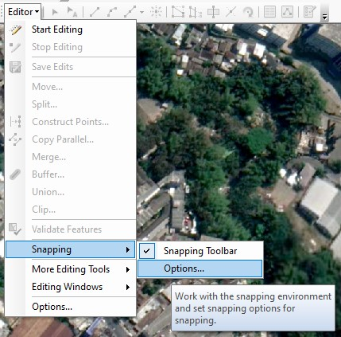

# 1b: Digitasi Garis dan Snapping

Pada praktikum kali ini, Anda akan mendigitasi jalan berdasarkan citra satelit pada area kampus Polinema.

Snapping berguna untuk membantu menyambungkan garis jalan yang sudah dibuat. Pointer akan otomatis mengepaskan posisi garis, sumbu, maupun elemen geometri lain yang berada didekatnya. Hal ini akan mempermudah Anda dalam melakukan digitasi, sehingga tidak ada garis yang terputus.


Praktikum ini membutuhkan koneksi internet yang cepat dan stabil, karena mengakses peta dasar secara online. Jika koneksi tidak lancar, maka Anda dapat memanfaatkan sumber peta dasar lain secara offline.


### Langkah 1: Konfigurasi snapping

Klik **Editor** &gt; **Snapping** &gt; **Options...**

Pastikan nilai toleransi snap minimal **10 pixels**. Check box pada **Show tips**, **Layer name**, **Snap type**, dan **Background**.

Klik **OK** untuk menutup kotak dialog.

### Langkah 2: Mengaktifkan Feature Construction toolbar

Feature Construction toolbar merupakan cara cepat untuk mengakses beberapa peralatan yang umum digunakan ketika proses editing. Secara default, toolbar ini statusnya off. Untuk mengaktifkannya adalah sebagai berikut.

Klik **Editor** &gt; **Options**.

Pada tab **General**, check box **Show feature construction toolbar**.

Klik **OK** untuk menutup kotak dialog **Editing Options**.

### Langkah 3: Memulai Digitasi Garis

Buatlah sebuah shapefile dengan jenis **Polyline**.

Kemudian Anda dapat memulai membuat garis, misalnya jalan di kampus Polinema.


Pastikan Anda sudah memilih **Line** pada **Construction Tools** dan sudah klik **Straight Segment** pada **Editor toolbar**.


