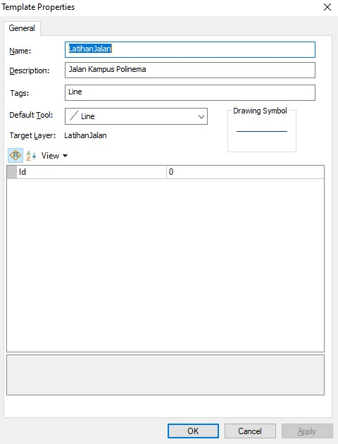
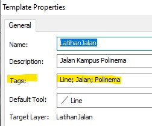
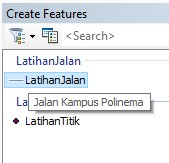

# 1c: Pengaturan Properti Fitur Template

Pada kotak dialog Template Properties Anda dapat mereview dan mengubah konfigurasi template. Sebagai contoh, merubah nama template, menambahkan deskripsi, mengeset _construction tool_, dan menspesifikasikan nilai atribut untuk fitur baru yang dibuat berdasarkan template ini.

### Langkah 1

Buka jendela **Create Features**, _double-click_ pada fitur yang telah Anda buat tadi. Misalnya hasil digitasi garis \(jalan di kampus polinema\), sehingga akan terbuka kotak dialog **Template Properties**.

### Langkah 2

Pada bagian **Description**, ketikkan informasi misalnya _Jalan Kampus Polinema_. Deskripsi ini nanti akan muncul ketika pointer diarahkan ke template ini di jendela **Create Features**.

### Langkah 3

Anda juga bisa menambahkan keterangan _tag_ untuk membantu ketika melakukan pencarian data. Untuk _tag_ jenis layer \(seperti polygon, polyline, point, dsb\) otomatis sudah ditambahkan.

Klik bagian Tags, tambahkan semicolon \( ; \), spasi, kemudian ketik misalnya _Polinema; jalan_.

Klik **OK**.

Jika Anda mengarahkan pointer ke sebuah template, maka Anda akan melihat deskripsi yang sudah Anda ketik tadi seperti pada gambar berikut ini.

