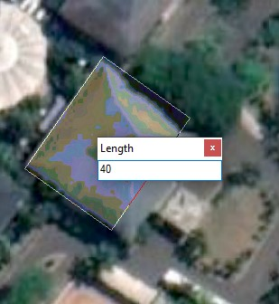

# 1d: Membuat Fitur Poligon Baru

Anda telah mempelajari beberapa hal dasar dalam melakukan editing elemen dan cara membuat fitur. Pada praktikum kali ini Anda akan menggunakan beberapa metode berbeda untuk membangun batas-batas poligon, termasuk snapping, menginputkan pengukuran, dan menggambar persegi panjang. Anda dapat memanfaatkan shortcut pada keyboard dan menu pada klik kanan untuk meningkatkan produktivitas kerja saat membuat fitur-fitur baru.

## Membuat poligon menggunakan beragam metode konstruksi

### Langkah 1

Buat shapefile baru dengan jenis fitur berupa **polygon**.

Kemudian _Zoom in_ ke Gedung Teknik Sipil Polinema. Mulailah mengedit fitur dengan klik kanan pada layer polygon yang baru saja dibuat, pilih **Edit Features** &gt; **Start Editing**.

### Langkah 2

Pada **Editor toolbar** klik **Straight Segment** .

### Langkah 3

Mulailah membuat poligon dengan peta dasar Gedung Teknik Sipil Polinema. Untuk mengakhiri, tekan **F2** pada keyboard atau klik **Finish Sketch**.

## Membuat poligon berupa persegi panjang

Terkadang Anda butuh untuk membuat poligon berupa persegi panjang. Dari pada membuat empat sumbu titik yang biasa dilakukan sebelumnya, Anda dapat membuatnya menggunakan **Rectangle construction tool**. Pada saat klik pertama, alat Rectangle akan membuat simpul pertama, kemudian klik kedua akan membentuk sudut dari persegi panjang, dan klik terakhir untuk menambah simpul sudut.

### Langkah 1

Pastikan jendela **Construction Tools** sudah tampil, lalu pilih **Rectangle**. Pastikan juga Anda sudah berada pada **sesi Editing** pada fitur template poligon.

### Langkah 2

Anda sekarang dapat memulai membuat persegi panjang. Untuk membuat persegi panjang secara presisi, Anda dapat memanfaatkan shortcut pada keyboard seperti langkah berikut.

Setelah klik pertama, tekan huruf **D** pada keyboard, kemudian ketik angka **derajat** kemiringan yang dibutuhkan, lalu tekan **ENTER** untuk menerapkan.


Secara default, derajat kemiringan menggunakan sistem polar, yang diukur searah jarum jam dari sumbu-x positif. Anda dapat mengubah sistem derajat ini atau satuannya dari menu Editing Options lalu pilih tab Units.


Tekan huruf **W** pada keyboard, kemudian ketik angka berapa meter **lebar** dari persegi panjang yang dibutuhkan, lalu tekan **ENTER**.

Gerakkan kursor ke atas dan kiri sehingga persegi panjang terbentuk pada posisi yang benar. Tekan huruf **L** pada keyboard, ketik angka berapa meter **panjang**nya, lalu tekan **ENTER**.


Tip: Selain menggunakan shortcut pada keyboard, Anda juga dapat menggunakan klik kanan untuk mengakses menu yang berisi perintah sama bahkan lebih lengkap.



Praktikum 1 sudah selesai.


