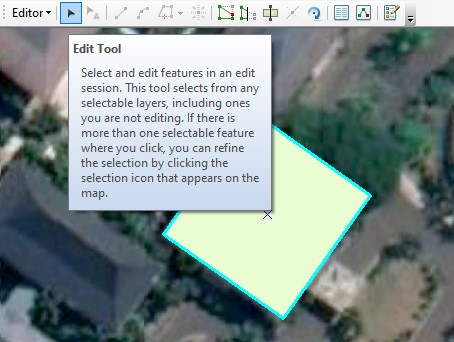
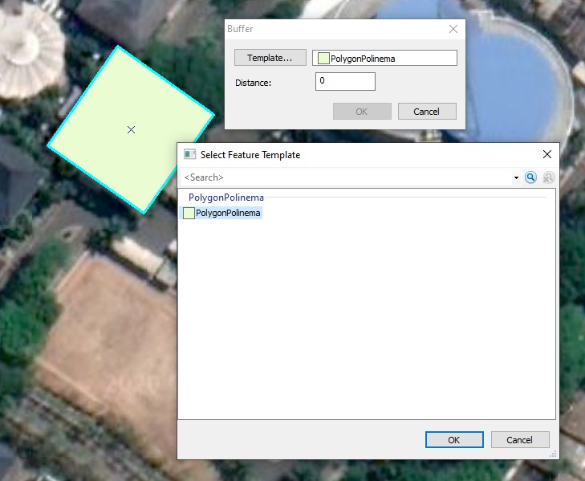
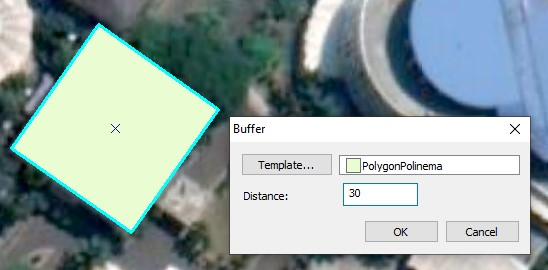
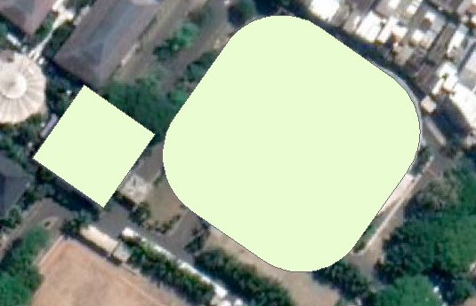

# 2a: Membuat Fitur dari Fitur yang Telah Ada

## Tentang fitur buffering

Untuk membuat fitur yang mirip atau istilah lain kloning dari fitur yang sudah ada, dapat menggunakan perintah Buffer. Langkah-langkahnya adalah sebagai berikut:

### Langkah 1

Masuk ke **sesi Editing**. Klik **Edit Tool** pada Editor toolbar.

Kemudian pilih fitur mana yang ingin digandakan, bisa berupa poligon, polyline, dan titik.

### Langkah 2

Klik menu **Editor** &gt; klik **Buffer**. Lalu akan muncul kotak dialog Buffer. Klik tombol Template untuk memilih **Feature Template** sehingga hasil buffer akan sesuai dengan feature template yang dipilih. Klik **OK**.

### Langkah 3

Ketik angka misal **30** pada buffer **Distance**. Ini artinya fitur akan dibuat lebih besar dari fitur awal dengan jarak 30 meter \(sesuai satuan peta yang digunakan\) dari tepi garis poligon yang dipilih.

Klik **OK**. Sebuah fitur baru telah dibuat lebih besar \(pemekaran\) dengan jarak 30 meter.

