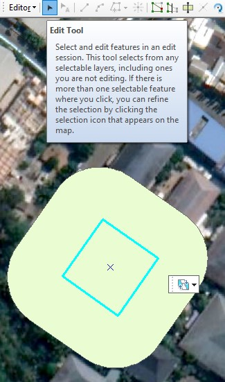
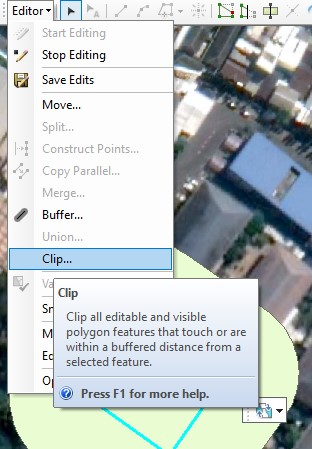
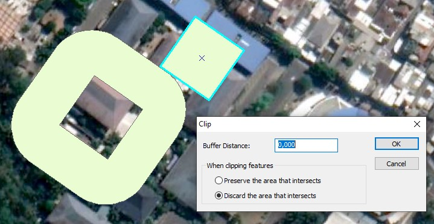
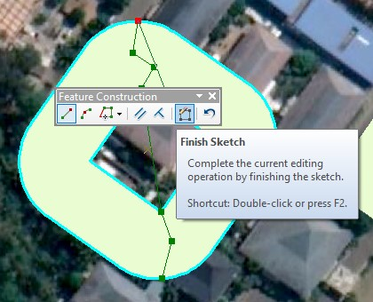
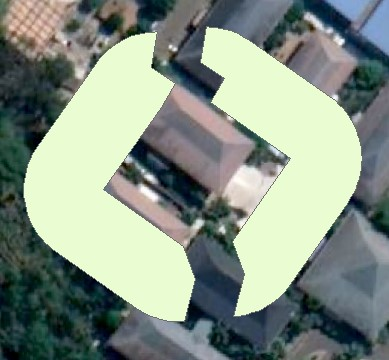

# 2b: Mengedit Fitur Poligon

## Membuat lubang di dalam sebuah poligon

### Langkah 1

Pastikan Anda sudah di **sesi Editing**. Klik **Edit Tool** pada _Editor Toolbar_.

Kemudian tentukan poligon mana yang ingin dibuat lubang dan letakkan poligon lain di atas poligon tersebut.

### Langkah 2

Pilih poligon yang berada diatasnya, lalu klik menu **Editor** &gt; klik **Clip**. Maka akan muncul kotak dialog Clip.

Jika Anda butuh clipping yang presisi, maka pastikan nilai **Buffer Distance** adalah 0.

Klik **Discard the area that intersects**. Ini akan menghapus area overlap dari fitur yang sedang di potong.


Untuk **Preserve the area that intersects**, ini akan menghapus di luar area overlap dari fitur yang sedang di potong.


### Langkah 3

Klik **OK**. Hasilnya seperti pada gambar berikut ini.

## Memotong sebuah poligon

Terkadang Anda butuh untuk memotong poligon, seperti sebuah danau yang dilewati jembatan, bangunan yang terpisah oleh jalan, atau kasus-kasus lain. Caranya adalah sebagai berikut.

### Langkah 1

Pastikan Anda sudah di **sesi Editing**. Klik **Edit Tool** pada _Editor Toolbar_.

Pilih poligon mana yang ingin dipotong. Klik menu **Snapping** pada _Snapping toolbar_ dan klik **Intersection Snapping**. Ini akan membantu Anda ketika mulai memotong antar fitur dapat pas dengan garis atau elemen geometri lain yang ada di sekitar poligon hingga akhir.

### Langkah 2

Klik **Cut Polygons tool** pada _Editor toolbar_. Mulailah melakukan pemotongan pada poligon.

### Langkah 3

Jika sudah selesai proses menandai bagian yang dipotong, maka tekan **F2** pada keyboard untuk memotong poligon dan mengakhirinya.

