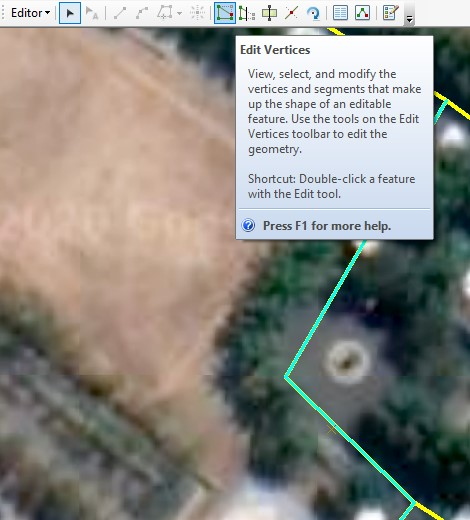
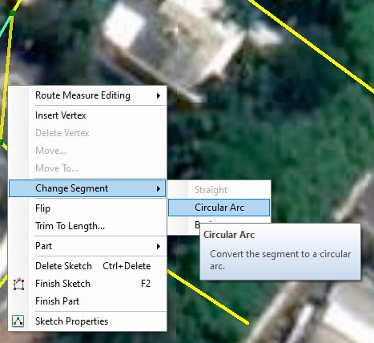
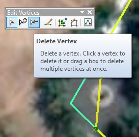
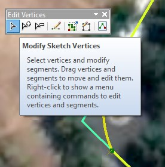
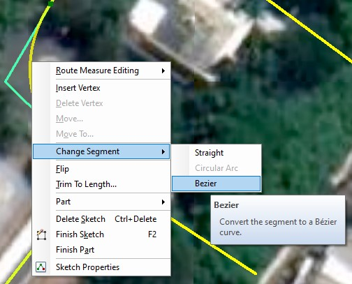

# 2c: Mengedit Simpul dan Segmen

Pada praktikum sebelumnya Anda telah melakukan editing fitur poligon. Pada kesempatan ini, Anda akan belajar memperbaiki simpul dan segmen atau melakukan _make up_ pada sebuah fitur. Anda dapat double-click pada fitur menggunakan Edit tool untuk mengeditnya. Ketika Anda melakukan hal ini, pada pointer Edit tool berubah dari panah hitam menjadi panah putih yang menunjukkan bahwa Anda dapat mengedit langsung pada simpul dan segmennya.

### Langkah 1

Pastikan Anda sudah menyimpan hasil pekerjaan sebelumnya. Selanjutnya masih tetap dalam sesi Editing. Klik **Edit tool** lalu pilih garis yang ingin diperbaiki. Kemudian klik **Edit Vertices** pada Editor toolbar.


Simpul dan segmen yang diperbaiki berdasarkan citra satelit atau hasil drone pada peta dasarnya. Jika garis yang dibuat misalnya kurang rapi, maka Anda dapat mengubah dari mode garis lurus menjadi _circular arc_ atau _Bezier curve_, dan bisa juga menghapus simpul-simpul yang tidak dibutuhkan.


### Langkah 2

Dekatkan pointer ke tengah garis atau segmen sehingga pointer berubah icon. Klik kanan pada titik itu, pilih **Change Segment** &gt; klik **Circular Arc**.

Ubah segmen dengan klik arc, drag, dan drop sesuai kebutuhan. Anda juga dapat sambil menekan **SPACEBAR** pada keyboard untuk menonaktifkan mode _snapping_ sementara jika kesulitan menempatkan kurva yang diinginkan.

### Langkah 3

Klik **Delete Vertex tool** pada **Edit Vertices toolbar.** Lalu pilih simpul mana yang ingin dihapus, dengan cara drag membentuk area kotak pada simpul-simpul yang ingin dihapus.

### Langkah 4

Klik **Modify Sketch Vertices tool** pada **Edit Vertices toolbar**. Hal ini akan melanjutkan pekerjaan dalam editing simpul dan segmen.

Dekatkan pointer ke bagian tengah segmen sehingga berubah icon seperti pada langkah 2 di atas. Klik kanan lalu pilih **Change Segment** &gt; klik **Bezier**.

### Langkah 5

Jika Anda sudah selesai mengedit, maka Anda dapat mengakhirinya dengan menekan tombol **F2** pada keyboard.

Klik menu **Editor** &gt; **Save Edits**. Lalu pilih lagi menu **Editor** &gt; **Stop Editing**.


Praktikum 2 sudah selesai.


