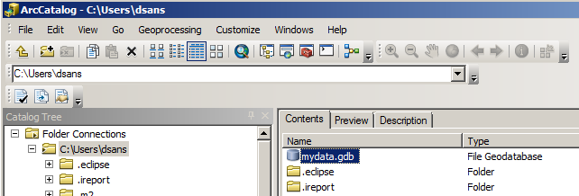
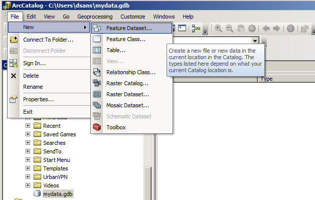

# Latihan 3b. Meng-edit Fitur Anotasi

Setelah label dibuat, akan dilakukan edit dan menambahkan fitur anotasi yang belum ditempatkan ke peta. Tampilan Unplaced Annotation memungkinkan Anda melihat fitur anotasi yang belum ditempatkan, dalam. Anda bisa memfilter tabel agar menampilkan anotasi untuk kelas anotasi tertentu saja. Dapat juga dipilih apakah akan menampilkan anotasi untuk seluruh data atau yang terlihat saat ini saja. Anda dapat mengurutkan tabel berdasarkan abjad dari teks penjelasan.

## 3.4 Menempatkan Fitur Anotasi yang Belum Ditempatkan dalam Peta

1. Klik menu **Editor** dalam toolbar **Editor** kemudian klik **Start Editing**.
2. Klik menu **Editor** dalam toolbar **Editor**, arahkan **Editing Windows**, kemudian klik **Unplaced Annotation**.
3. Pada tampilan **Unplaced Annotation**, centang kotak **Draw** agar menampilkan anotasi yang belum ditempatkan pada peta.
4. Klik **Search Now**. Beberapa fitur anotasi akan muncul dalam tabel. Jika Anda menggulir tabel, dapat terlihat terdapat fitur anotasi yang tidak ditempatkan dari beberapa kelas. Dapat terlihat juga beberapa fitur penjelasan baru yang diuraikan dalam warna merah di peta.
5. Klik tool **Edit Annotation**   dalam toolbar **Editor**.
6. Klik peta, tekan dan tahan tombol Z, lalu klik dan seret kotak di sekitar fitur anotasi yang tidak ditempatkan di sisi timur taman. Tombol Z adalah pintasan keyboard untuk memperbesar. Untuk menggeser ke daerah ini, Anda dapat menekan tombol C. Anda juga dapat menavigasi ke bookmark Zion Canyon.

Lapisan background Hillshade memiliki rentang skala yang terlihat; ketika diperbesar lebih dekat dari 1: 85.000, maka menjadi tidak terlihat. Mengatur rentang skala yang dapat terlihat juga dapat dilakukan untuk kelas fitur anotasi, karena dapat dioptimalkan kepada rentang skala yang dapat terbaca. Anda bisa mengatur rentang skala yang terlihat untuk layer di ArcMap, atau Anda bisa mengubah properti dari kelas fitur anotasi itu sendiri. Metode kedua memiliki keuntungan bahwa kelas fitur anotasi akan selalu ditarik dalam rentang skala yang terlihat ketika ditambahkan ke peta.

1. Sekarang Anda telah memperbesar ke kumpulan anotasi yang tidak ditempatkan di sisi timur taman, Anda siap untuk mulai menempatkan fitur anotasi yang tidak ditempatkan. Klik **Search Now**.
2. Klik kanan **Birch Creek** pada kolom **Text** dan klik **Place Annotation**. Fitur anotasi Birch telah ditempatkan. Ketika terpilih, maka akan memiliki garis biru dan bukan garis merah.

## 3.5 Membuat Anotasi Mengikuti Panjang Fitur

Fitur anotasi dapat ditempatkan sejajar dengan segmen fitur stream. Kurva fitur anotasi aliran lainnya akan mengikuti aliran, sehingga fitur anotasi yang baru dapat ditempatkan mengikuti aliran. Anda dapat membuat fitur anotasi mengikuti fitur garis atau batas fitur poligon. Kotak dialog Follow Feature Options memungkinkan Anda menentukan bagaimana anotasi akan berperilaku ketika mengikuti fitur.

1. Menggunakan tool **Edit Annotation**, klik kanan fitur anotasi **Birch Creek**, arahkan ke **Follow**, kemudian klik **Follow Feature Options**.
2. Untuk  **Make annotation**, klik **Curved**.
3. untuk **Constrain Placement**, klik tombol **Side cursor is on** untuk membatasi penempatan anotasi.
4. Ketik **100** pada kotak isian **Offset from feature** text box. Anotasi akan ditempatkan 100 meter dari alur.
5. Klik **OK**.
6. Pindahkan pointer ke atas fitur stream, sebelah selatan fitur anotasi Birch Creek, lalu klik kanan, kemudian klik **Follow This Feature**.

Fitur aliran akan berkedip, dan fitur anotasi cenderung mengikuti arus. Fitur anotasi yang dipilih akan mengikuti fitur baris apa pun yang Anda klik kanan dan menggunakan alat Edit Annotation.

1. Tempatkan pointer di tengah-tengah fitur anotasi **Birch Creek**.
2. Seret fitur anotasi **Birch Creek** di sepanjang fitur stream. Tekan tombol L saat Anda menyeret anotasi jika perlu memutar arah bacanya.

## 3.6 Menyusun dan Memutar Anotasi

Anda telah menempatkan fitur anotasi dan membuatnya mengikuti fitur lain dengan alat Edit Anotasi. Alat Edit Anotasi juga memungkinkan Anda untuk mengedit fitur anotasi lainnya.

1. Dalam window **Unplaced Annotation**, klik **Grotto Springs**, kemudian klik kanan lalu pilih **Pan to Annotation**.
2. Tekan SPACEBAR, yang merupakan pintasan keyboard untuk menempatkan fitur anotasi yang dipilih.

1. Klik kanan fitur pada peta dan klik **Stack**. Fitur anotasi Grotto Springs akan terpisah. kata **Grotto** ditempatkan di atas kata **Springs.**
2. Tempatkan pointer di tengah fitur anotasi **Grotto Springs**. Pointer akan berubah menjadi pointer move. Klik posisi tengah pada fitur anotasi **Grotto Springs** kemudian seret ke arah barat daya sehingga berada di antara fitur spring.

1. Pada window **Unplaced Annotation**, klik  **Zion Canyon Scenic Drive** kemudian tekan tombol P, yang mana adalah pintasan keyboard untuk menggeser ke fitur anotasi yang dipilih.
2. Klik kanan **Zion Canyon Scenic Drive** kemudian pilih **Place Annotation**.
3. Klik kanan fitur anotasi **Zion Canyon Scenic Drive** pada peta kemudian klik **Stack**.
4. Klik posisi tengah fitur anotasi **Zion Canyon Scenic Drive** dengan pointer Move Annotation kemudian seret ke arah barat daya hingga ujung selatan fitur anotasi dekat persimpangan dengan jalan yang bercabang ke timur, Highway 9.
5. Pindahkan pointer dari warna biru, berbentuk pasak di sudut timur laut fitur anotasi **Zion Canyon Scenic Drive** hingga pointer menjadi pointer rotate. Klik sudut dan seret berlawanan arah jarum jam hingga fitur anotasi mengikuti jalan.

1. Anda dapat terus menempatkan dan mengedit fitur anotasi. Ketika kamu selesai, tutup jendela **Unplaced Annotation** .

