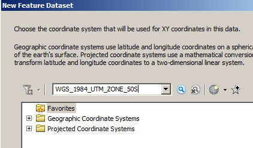
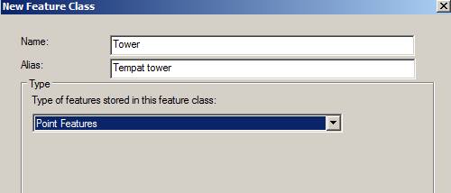

# Transformasi Data Spasial

1. **Spatial Adjusment**

Di dalam ArcMap dapat dilakukan Spatial Adjusment berdasarkan transformasi menurut koordinat sumber dan titik tujuan \(titik kontrol\). ArcMap menyediakan tiga proses transformasi yaitu affine , similarity, dan projective, yang dapat diterapkan pada Feature Polygon serta transformasi Rubbersheet dan EdgeSnap yang dapat diterapkan pada feature garis.

Transformasi affine dapat melakukan differential scaling, skew, rotation , dan translation pada data, transformasi ini memerlukan minimal 3 titik kontrol. Transformasi similarity menskalakan, merotasi, dan mentranslasi data tetap mempertahankan aspek rasio dari feature yang ditransformasikan, pada transformasi inn hanya memerlukan minimal 2 titik kontrol. Sementara Transformasi projective berdasarkan pada formula yang lebih kompleks yang memerlukan minimal 4 titik kontrol.

1. **Transformasi**

Langkah Praktikum :

1. Buka ArcMap
2. Tampilkan Toolbar Spatial Adjusment, dengan klik kanan pada toolbar utama, pilih Spatial Adjusment.
3. Tampilkan data polygon Simple Parcel dan New Parcel dari folder \Pelatihan ArcGIS\SpatialAdjustment\, dengan klik Add Data, pilih Transform.mdb\Simple edit, 76 kemudian klik Add Feature New Parcel dan New Building yang akan di-adjust ke Simple Building dan Simple Parcel.
4. Mulai editing, dengan klik Start Editing pada Editor Toolbar, kemudian aktifkan mode Snapping.
5. Mulai Adjusment dengan menentukan data yang akan di-adjust terlebih dahulu melaluli Spatial A djusment

Pilih NewBuilding dan NewParcel karena yang akan ditransformasikan adalah kedua data tersebut. Kemudian klik OK

1. Pilih metode Transformasi, melalui Spatial Adjusment &gt; Adjusment Methods &gt;Tranformation &gt; Similarity
2. Buat Dispalcement Link, dengan klik pada Spatial Adjusment Toolbar, atau button untuk Multidisplacement Link.

1. Klik Adjust untuk mentransformasi data yang telah dipilih.
2. Klik Stop Editing

Hasil Transformasi dengan menggunakan metode Similarity

1. Lakukan langkah tersebut diatas untuk mencoba transformasi Affine dan Projective. Buat Displacement Link sesuai dengan posisi pada SimpleParcel dan NewParcel
2. **Rubbersheet**

Rubber sheeting mengkoreksi kesalahan koordinat dengan geometric adjustment , Sama seperti transformasi, displacement links yang digunakan dalam rubbersheeting ini digunakan untuk menggambarkan feature yang dipindah.

Langkah Praktikum :

1. Tampilkan data \Pelatihan ArcGIS\SpatialAdjustment, pilih rubbersheet.mdb &gt;Transportation, kemudian klik Add

Feature ImportStreet.shp akan di-adjust ke feature Street.shp

1. Klik kanan pada layer Import StreetsZoom to layer

1. Mulai editing, dengan klik Start Editing pada Editor Toolbar. Kemudian aktifkan mode Snap pada semua feature yang ada.
2. Mulai Adjusment dengan menentukan data yang akan di-adjust terlebih dahulu melaluli Spatial Adjusment  Set Adjust Data...

Pilih ImportStreet kemudian klik OK.

1. Pilih metode Transformasi, melalui Spatial Adjusment &gt; Adjusment Methods &gt; Rubbersheet

Buat Dispalcement Link, dengan klik pada Spatial Adjusment Toolbar, atau button untuk Multidisplacement Link.

1. Buat Displacement Link, dengan klik pada spatial Adjusment Toolbar, atau button untuk Multidisplacement Link. \(Untuk Rubbershet labih baik menggunakan Multidisplacement Link\)
2. Klik pada posisi import street, lalu pilih vertex, klik OK

1. Klik pada posisi import street, lalu pilih vertex, klik OK, muncul kotak isian No of Link, Tekan Enter

Buat Displacement Link yang lain sesuai dengan posisi pada ImportStreet dan Street

1. Klik Adjust untuk mentransformasi data yang telah dipilih

Hasil Transformasi dengan menggunakan metode Rubbersheet

1. **EgdeSnap**

Proses edgematching mengatur features sepanjang edge dari satu layer ke features dari layer addjoin . Layer yang kurang akurat di-adjust, dan layer lainnya sebagai kontrol.

Langkah Praktikum :

1. Buka data di \Pelatihan ArcGIS\SpatialAdjustment, pilih EdgeMap.mdb &gt; water, kemudian klik Add

Data StreamNorth dan StreamSouth akan di-matchkan.

1. Mulai editing, dengan klik Start Editing pada Editor Toolbar. Kemudian aktifkan mode Snap pada semua feature yang ada
2. Mulai Adjusment dengan menentukan data yang akan di-adjust terlebih dahulu melalui Spatial Adjusment &gt; Set Adjust Data...

Pilih StreamSouth dan StreamSouth, kemudian klik OK

1. Pilih metode Transformasi, melalui Spatial Adjusment &gt; Adjusment Methods &gt; Edge Snap
2. Klik Spatial Adjusment &gt; Option

Pada tab General, Pilih Edge Snap pada Adjustment method

Pada tab Edge Match, pilih StreamSouth pada Source Layer dan StreamNort pada Target Layer

1. Klik OK
2. Buat Displacement Link antara StreamNorth dan StreamSouth dengan menggunakan button \(Edge Match\). Klik kursor antara pertemuan garis StreamNorth dan StreamSouth sampai muncul endpoint
3. Klik Adjust untuk mentransformasi data yang telah dipilih ,Jangan Lupa untuk Stop Editing dan menyimpan \(Save\) hasil Editing. Buat Displacement Link antara StreamSouth dan StreamNorth

Hasil Adjusment menggunakan EdgeSnap

