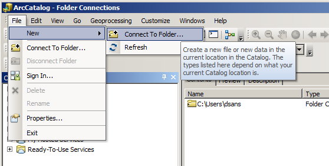
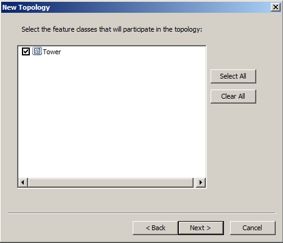
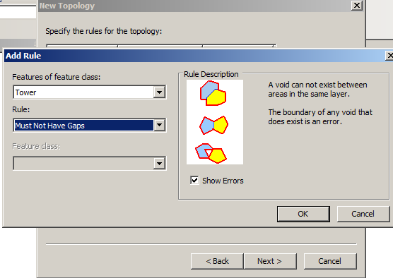
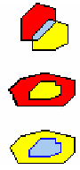

# Analisis Topologi

**Topology**

1. **Pengertian Topology**

Topology yaitu satu set aturan/ketetapan \(dalam hal ini disebut sebagai Rule\) yang diterapkan pada Feature Class yang secara eksplisit mendefinisikan hubungan spasial yang harus ada di antara data feature di dalam Feature Datasets dari sebuah geodatabase. Rule atau aturan-aturan yang berlaku terhadap jenisjenis feature class tertentu tergantung kepada jenis/tipe data, apakah titik, garis, ataukah area/poligon.

1. **Jenis- - jenis Topology**
2. Feature Class Point/Titik

Berikut ini adalah beberapa aturan yang bisa diterapkan pada feature class point.

1. Must Be Covered By Boundary Of

|  | Feature titik dari satu layer harus bersinggungan dengan batas dari feature poligon lainnya. Bila feature dari layer titik berada diluar poligon, titik tersebut dianggap sebagai suatu kesalahan error. |
| :--- | :--- |

1. Must Be Covered By Endpoint Of

|  | Feature titik pada suatu layer harus berada di ujung feature garis atau layer lainnya. Bila feature titik tidak berada di ujung/tepi feature garis, maka titik tersebut dianggap sebagai error. |
| :--- | :--- |

1. Point Must Be Covered By Line

|  | Feature titik harus terkover oleh feature garis atau feature lainnya. Titik yang tidak berada diatas feature garis dianggap sebagai error. |
| :--- | :--- |

1. Must Be Properly Inside

|  | Feature titik harus benar-benar berada didalam area poligon suatu layer. Titik yang berada di luar area/poligon dianggap sebagai error. |
| :--- | :--- |

1. Feature Class Line/Garis

Berikut ini adalah beberapa set aturan yang dapat diaplikasikan terhadap feature class tipe garis.

1. Must Not Overlap

|  | Suatu feature garis tidak boleh mengoverlap garis lain pada layer yang sama. garis yang mengoverlap dianggap sebagai error. |
| :--- | :--- |

1. Must Not Intersect

|  | Suatu feature garis tidak boleh meng-intersect \(memotong\) atau mengoverlap \(menumpang\) garis lain pada layer yang sama. garis yang saling menumpang \(overlap\) atau titik perpotongan dianggap sebagai error. |
| :--- | :--- |

1. Must Not Covered by Feature Class Of

|  | Garis dari satu layer harus serupa dengan garis lain dari layer lainnya. Garis pada layer pertama yang tidak serupa dengan garis pada layer kedua dianggap sebagai error. |
| :--- | :--- |

1. Must Not Overlap With

|  | Garis dari satu layer harus tidak overlap dengan garis dari layer lainnya. Garis yang meng-overlap dianggap sebagai error. |
| :--- | :--- |

1. Must Be Covered By Boundary Of

|  | Feature garis dari satu layer harus sejajar dengan tepi/batas feature area dari layer poligon yang ada. Garis yang tidak sejajar dengan batas feature poligon dianggap sebagai error. |
| :--- | :--- |

1. Must Not Have Dangles

|  | Garis pada suatu layer garis kedua ujungnya harus menyentuh garis pada layer yang sama. Suatu garis yang tidak menyentuh garis lainnya dianggap sebagai error. |
| :--- | :--- |

1. Must Not Have Pseudos

|  | Ujung garis pada suatu layer harus menyentuh lebih dari satu garis dari layer yang sama. Titik ujung dimana garis menyentuh titik ujung garis lainnya dianggap sebagai error. |
| :--- | :--- |

1. Must Not Self-Overlap

|  | Feature garis pada suatu layer tidak boleh memotong \(intersect\) atau menumpang \(overlap\) dirinya sendiri. Garis yang menumpang dirinya sendiri dianggap sebagai error. |
| :--- | :--- |

1. Must Not Self-Intersect

|  | Feature garis pada suatu layer tidak boleh memotong feature itu sendiri. Garis yang menumpang \(overlap\) feature itu sendiri, atau titik dimana feature itu memotong dirinya sendiri dianggap sebagai error. |
| :--- | :--- |

1. Must Be Single Part

|  | Feature garis pada suatu layer tidak boleh terdiri lebih dari satu bagian. Feature garis yang memiliki lebih dari satu garis dianggap sebagai error. |
| :--- | :--- |

1. Must Not Intersect Or Touch Interior

|  | Garis pada suatu layer harus menyentuh ujung garis dari layer yang sama. Garis yang menumpang \(overlap\) atau titik perpotongan dianggap sebagai error. |
| :--- | :--- |

1. Endpoint Must Be Covered By

|  | Ujung suatu garis pada suatu layer harus ditutup oleh fetaure titik layer yang lain. Ujung garis yang tidak ditutup oleh feature titik dianggap sebagai error. |
| :--- | :--- |

1. **Feature Class Polygon/Area**

Berikut ini adalah beberapa set aturan yang dapat diterapkan pada feature class type poligon.

1. Must Not Overlap

|  | Suatu poligon tidak boleh menumpang \(overlap\) poligon lain pada layer yang sama. Poligon yang saling menumpang \(overlap\) dianggap sebagai error. |
| :--- | :--- |

1. Must Not Have Gaps

|  | Ruang kosong tidak boleh ada diantara dua poligon pada satu layer. Batas/tepi ruang kosong yang ada dianggap sebagai error. |
| :--- | :--- |

1. Must Not Overlap With

|  | Poligon pada suatu layer tidak boleh saling menumpang \(overlap\) dengan poligon dari layer yang lain. area dimana fetaure dari layer kedua meng-overlap feature pada layer pertama dianggap sebagai error. |
| :--- | :--- |

1. Must Be Covered By Feature Class Of

|  | Feature area/poligon pada suatu layer harus menutupi feature poligon dari layer yang berbeda. Area dimana feature pada layer kedua tidak ditutupi oleh feature pada layer pertama dianggap sebagai error. |
| :--- | :--- |

1. Must Be Cover Each Other

|  | Feature area/poligon pada satu layer dan feature area pada layer lainnya harus saling menutupi satu sama lain. Area dimana feature dari kedua layer tidak menutupi layer lainnya dianggap error. |
| :--- | :--- |

1. Must Be Covered By

|  | Feature poligon pada suatu layer harus tercakup dalam feature dari layer yang lainnya. Area pada layer pertama yang tidak tercakup dalam feature pada layer kedua dianggap sebagai error. |
| :--- | :--- |

1. Boundary Must Be Covered By

|  | Tepi suatu poligon dari suatu layer harus ditutupi oleh garis dari layer yang lain. Batas feature poligon yang tidak sejajar dengan feature garis dianggap sebagai error. |
| :--- | :--- |

1. Area Boundary Must Be Covered By Boundary

|  | Batas/tepi suatu feature poligon pada suatu layer harus ditutupi oleh batas/tepi dari featur poligon dari layer yang lain. Batas dari suatu featur poligon yang tidak ditutupi oleh tepi dari poligon lainnya dianggap sebagai error. |
| :--- | :--- |

1. Contains Points

|  | Feature area/poligon pada suatu layer harus memuat setidaknya satu feature point dari layer lainnya. Feature poligon yang tidak memiliki setidaknya satu feature point dianggap sebagai error. |
| :--- | :--- |

1. **Penerapan Topology**

Setelah memahami jenis-jenis rule di atas, maka selanjutnya Anda dapat menentukan dan menggunakan rule yang diinginkan untuk mengatur obyek-obyek di dalam feature class. Selanjutnya buatlah topology di dalam Feature Datasets Peta Tematik Anda. Peta yang berformat shp tidak dapat dibuat topology, agar dapat harus dikonversi ke format geodatabase.

Langkah – langkah praktikum :

1. Buka ArcMap
2. Klik Catalog Window 
3. Masuk ke Folder Conection &gt; Pelatihan ArcGIS\(Sebelumnya buat folder ini terlebih dahulu\) &gt; Topology
4. Klik kanan pada folder Topology &gt; New &gt; Personal Geodatabase

1. Muncul New Personal Geodatabase.mdb, gantilah nama filenya menjadi Latihan.mdb
2. Klik kanan pada Latihan.mdbNewFeature Dataset...

1. Muncul kotak dialog New Feature Dataset, pada Name ketiklah nama dataset \(sesuai nama masing - masing\)
2. Klik Next
3. Pilih Projected Coordinate Systems &gt; UTM &gt; WGS 1984 &gt; Southern Hemisphere &gt; WGS 1984 UTM Zone 50S.prj
4. Klik Next
5. Klik Next
6. Klik Finish
7. Konversi format shp ke Feature Class
8. Klik kanan pada layer Landuse &gt; Export &gt; To Geodatabase \(Single\)
9. Pada Output Location, tempatkan pada Pelatihan ArcGIS\ Topology\ Latihan.mdb\nama kalian
10. Pada Output Feature Class ketik Landuse
11. Klik OK

**Membuat Topology Landuse**

1. Klik kanan pada feature dataset nama kalian &gt; New &gt; Topology, akan muncul

1. Klik Next
2. Isikan pada Enter a name for your topology dengan nama TopologyLanduse, Kemudian klik Next.

Catatan : nama topology tidak diperkenankan menggunakan spasi.

1. Centang pada layer Landuse
2. Klik Next
3. Tentukan number of ranks , lalu klik Next.
4. Klik Add Rule...

1. Pilihlah rule yang berupa Must Not Overlap
2. Klik OK
3. Klik Next
4. Klik Finish
5. Muncul kotak dialog,

1. Klik Yes

**Menampilkan data topology Landuse**

1. Add data topology yang telah dibuat \(TopologyLanduse\) dengan Add Data . . .
2. Aktifkan tool topology dengan klik kanan pada toolbar , kemudian pilih Topology.
3. Maka akan muncul tool topology seperti berikut ini.

Beberapa fungsi utama yang berkenaan dengan validasi dari topology yang kita

bangun dalam Topology Toolbar antara lain yaitu:

* Validate Topology In Specified Area

Tombol ini digunakan apabila kita ingin melakukan validasi terhadap area tertentu yang kita inginkan.

* Validate Topology In Current Extent

Tombol ini digunakan apabila kita ingin melakukan validasi terhadap feature yang tampil/tercakup dalam view yang ditampilkan.

* Fix Topology Error Tool

Tool yang digunakan untuk melakukan koreksi terhadap topology yang dianggap sebagai kesalahan.

* Error Inspector

Fungsi yang digunakan untuk mencari kesalahan, atau item yang melanggar aturan topologi yang telah dipilih. Dengan memilih tombol Error Inspector, kita akan membuka window baru.

1. Pada toolbar Editor, Klik Editor Start Editing
2. Klik ikon Error Inspector
3. Pada Show: pilih Landuse –Must Not Overlap
4. Klik Search Now, a kan muncul data polygon yang mengalami kesalahan

1. Pilihlah data tersebut, lalu klik kanan. Pilihan yang tersedia adalah:

* Zoom To: memperbesar tampilan pada bagian yang mengalami kesalahan
* Pan To: Menggeser tampilan pada bagian yang mengalami kesalahan
* Select Feature: meemilih poligon yang mengalami kesalahan
* Substract: menghapus poligon pada bagian yang mengalami kesalahan/overlap
* Merge: menggabungkan poligon yang overlap dengan poligon sebelahnya
* Create Feature: merubah poligon yang overlap menjadi poligon baru
* Mark as Exception: membuat pengecualian

**Membuat Topologi jalan**

1. Klik kanan pada feature dataset nama dataset &gt; New &gt; Topology, akan muncul

1. Klik Next
2. Isikan pada Enter a name for your topology dengan nama TopologyJalan, Kemudian klik Next.
3. Centang pada layer Jalan
4. Klik Next
5. Tentukan number of ranks , lalu klik Next.
6. Klik Add Rule...

1. Pilihlah rule yang berupa Must Not Have Dangles
2. Klik OK
3. Klik Next
4. Klik Finish
5. Muncul kotak dialog,

1. Klik Yes

**Menampilkan data topology Jalan**

1. Add data topology yang telah dibuat \(TopologyJalan\) dengan Add Data . . .

Tanda titik pada ujung garis adalah dangles, dangles adalah titik yang muncul karena ujung garis tidak bertemu dengan ujung garis yang lain. Tidak semua dangles pada ujung garis artinya salah.

1. Klik ikon Error Inspector
2. Pada Show: pilih Jalan –Must Not Have Dangles
3. Klik Search Now, akan muncul data yang mengalami kesalahan

1. Pilihlah data tersebut, lalu klik kanan. Pilihan yang tersedia untuk editing adalah:

* Snap: ujung dari garis akan menangkap ujung garis lain yang terdekat sesuai dengan nilai toleransi yang ditetapkan
* Extend: ujung garis akan menumbuk ke garis yang lain sesuai dengan nilai toleransi yang ditetapkan
* Trim: garis yang melewati garis yang lain akan dipotong dan dihapus sesuai dengan nilai toleransi yang ditetapkan

