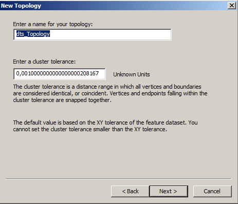
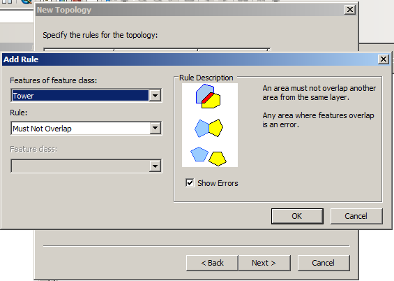
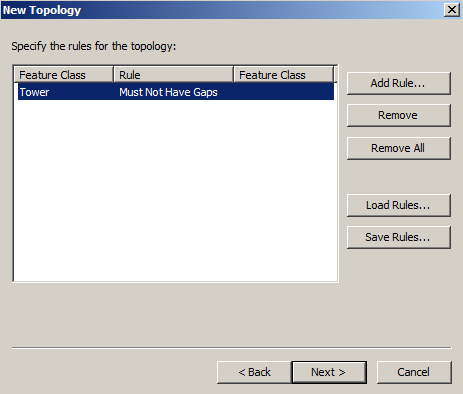

# TOPOLOGY GEODATABASE \(PRAKTIKUM\)

**MODUL PELATIHAN**

**TOPOLOGY GEODATABASE \(PRAKTIKUM\)**

1. **Membuat Geodatabase**

Geodatabase adalah set data, tool, model spasial yang dapat terdiri dari berbagai tipe, baik itu vektor maupun raster. Berikut adalah langkah - langkah dalam pembuatan geodatabase menggunakan arcGis :

1. Klik pada menu File &gt; New
2. Pilih geodatabase, apabila anda belum memilih folder, maka akan disarankan untuk memilih folder yang akan kita gunakan dalam menyimpan data yang akan kita buat \(gambar 1.1\). Apabila anda sudah membuat folder maka akan langsung muncul menu file seperti pada gambar 1.2.

**Gambar 1.1**

**Gambar 1.2**

1. Sebuah geodatabase yang siap diidi nama muncul di _Contents_. Isi nama dengan **mydata** \(gambar 1.3\).

**Gambar 1.3**

1. Selanjutnya kita akan mendefinisikan data/tool/model yang ada di dalam geodatabase tersebut. Double klik **mydata** untuk masuk.
2. Untuk membuat feature kosong di dalam geodatabase mydata, Klik pada menu &gt; New &gt; feature dataset \(gambar 1.4\) . Selanjutnya, beri nama **dts** pada dataset \(gambar 1.5\). Selanjutnya pilih next dan tentukan system koordinat menggunakan : WGS\_1984\_UTM\_ZONE\_50S \(gambar 1.6\). langkah selanjutnya biarkan nilai default dan pilih finish \(gambar 1.7\).

**Gambar 1.4 \(membuat feature baru\)**

**Gambar 1.5 \(menambahkan nama dataset\)**

**Gambar 1.6 \(koordinat\)**

**Gambar 1.7**

1. Setelah feature dataset dibuat, selanjutnya masuk ke dalam feature dataset tersebut dan buat feature class \(gambar 1.8\). Klik next&gt; Konfigurasi penyimpanan biarkan pada posisi default. Klik next&gt; \(gambar 1.9\)

**Gambar 1.8**

**Gambar 1.9**

1. Pengisian field bisa dilakukan sekarang ataupun nanti saat pengeditan di ArcMap. Klik Finish
2. Sebuah feature class sudah dibuat di dalam feature dataset dts pada geodatabase mydata.
3. **Topology**

Untuk memulai membangun topology dengan menggunakan ArcGIS 9.x dapat dilakukan tahapan tahapan sebagaimana berikut. Untuk topology data penggunaan lahan ataupun data data lainya, jendela ArcMap terlebih dahulu di tutup kemudian proses topology dapat dilakukan pada ArcCatalog dengan langkah langkah sebagai berikut:

1. Klik kanan pada feature dataset dalam geodatabase yang telah dibangun, new &gt; topology

1. Akan muncul kotak dialog New topology kemudian klik next
2. Di sini akan muncul kotak dialog yang mengharuskan kita untuk melakukan pemilihan \(pengaktifan\) feature yang akan dilakukan topology dan pemilihan rule yang akan dipakai terhadap feature tsb.

 

1. Pada tampilan selanjutnya akan muncul list rule yang bisa kita pilih sesuai karakteristik datanya.
2. Rule yang dipilih bisa lebih dari satu sesuai dengan karakteristik data yang akan diterapkan topology.
3. Untuk data penggunaan lahan berupa polygon dapat kita terapkan dua aturan \(rule\) yaitu:

* Must Not Overlap dan
* Must Not Gap

1. Pilih rule yang ke 2 seperti gambar berikut:

1. Sehingga akan muncul kotak dialog yang menampilkan ke 2 rule sebagai berikut:

1. Klik next &gt; finish. Lakukan proses validasi topology. Setelah itu akan muncul hasil topology.

