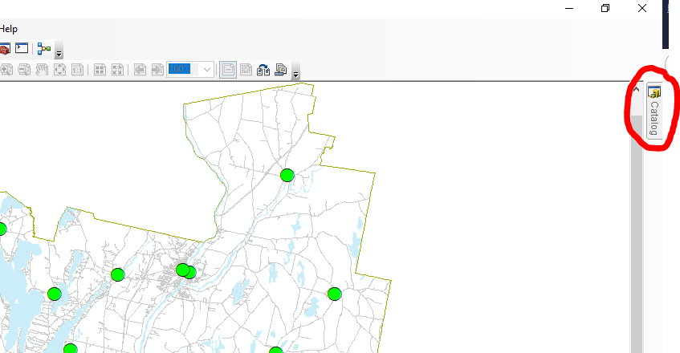
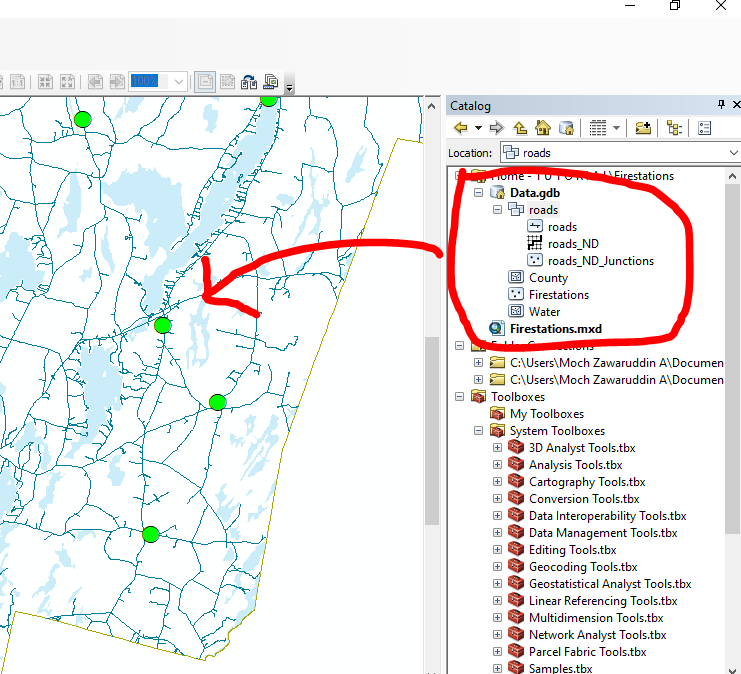
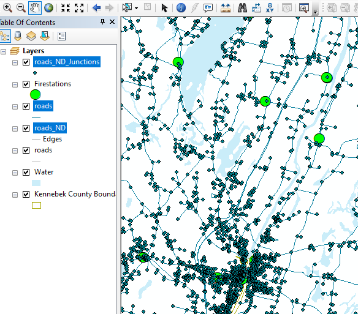
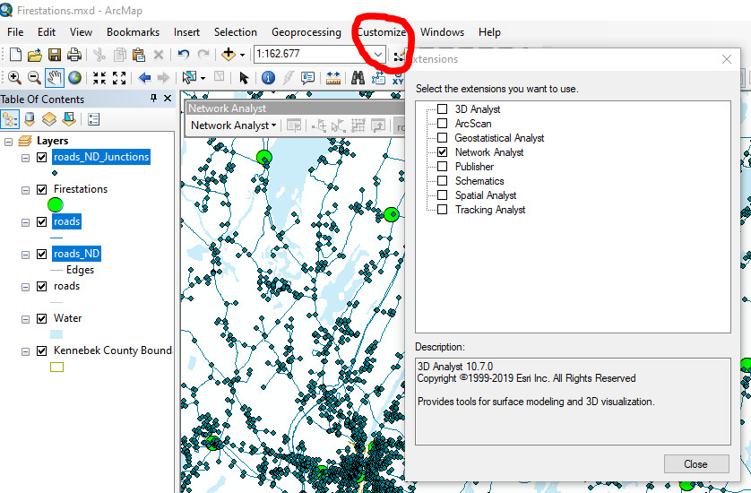

# Praktikum 1 - Pencarian Stasiun Pemadam Kebakaran \(Damkar\) yang berjarak radius 5KM

## Pengantar

* Buat folder dengan nama `"Damkar"` pada direktori folder laptop masing-masing. Contoh pada direktori "C:\Users\Laptop User\Documents\Damkar"
* Silahkan klik url [_https://mgimond.github.io/ArcGIS\_tutorials/Firestations\_files/Firestations.zip_](https://mgimond.github.io/ArcGIS_tutorials/Firestations_files/Firestations.zip) untuk _download_ contoh _dataset_ pemadam kebakaran.
* Ekstraksi file yang sudah ter-_download_ pada folder yang telah dibuat \(folder "Damkar"\).

## Tahapan

#### Tahap 1 - Set Up Map Dokumen

* Silahkan jalankan aplikasi `ArcMap`, pilih menu `file` pada menu pojok kiri atas, selanjutnya klik `open` dan pilih file **Firestations.mxd** hasil ekstrasi yang berada pada folder `Damkar`, selanjutnya klik OK.
* Peta yang ditunjukkan adalah peta wilayah _Kennebec County_ yang lengkap dengan jalan dan lokasi kantor Damkar.
* Untuk menggunakan fitur Analisis Jaringan _\(Network Analyst\)_, dataset Jaringan harus dibuka _\(_di _load\)_ di dalam dokumen peta. Dataset jaringan secara umum dibuat dalam file geodatabase `(gdb)`.
* Expand menu Catalog yang ada disebelah kanak aplikasi 

* lalu expand `Data.gdb`, kemudian expand fitur `Roads`.
* Pada fitur `Roads` terdapat 3 sub fitur yaitu
  * _**roads :**_ layer vektor yang telah dimuat \(load\) pada peta dokumen,
  * _**roads\_ND :**_ dataset jaringan yang digunakan untuk proses analisis jaringan _\(Network Analysis\)_.
  * _**roads\_ND\_Junctions :**_ penampung dari dataset jaringan yang mengidentifikasi semua persimpangan jalan.
* Dataset jaringan yang digunakan pada praktikum ini sudah dibuatkan. Untuk lebih lanjut dalam membuat dataset jaringan bisa merujuk pada link berikut [http://help.arcgis.com/en/arcgisdesktop/10.0/help/index.html\#/Creating\_a\_network\_dataset/00470000000w000000/](http://help.arcgis.com/en/arcgisdesktop/10.0/help/index.html#/Creating_a_network_dataset/00470000000w000000/)
* _Drag & Drop_ fitur pada bagian fitur yang dilingkari warna merah ke dalam peta dokumen untuk menambahkan fitur data yang akan ditampilkan.

* Pada bagian _**sidebar**_ bagian _**kiri**_ peta dokumen akan terdapat beberapa fitur yang telah dimuat \(load\)

* Mengaktifkan ekstensi Network Analyst, untuk memproses peta dokumen
* Buka menu `customize`, klik menu `extension` lalu checklist pada fitur Network Analyst

* Klik Close to keluar dari Extensions 

#### Tahapan 2 - Network Analysis Environment

* Pilih Customize -Toolbars - Network Analyst 
* Pilih Network Analyst - New Service Area 
* Untuk menambahkan Network Analyst Window ke dokumen peta, klik SHow/Hide Network Analyst Window 
* Klik kanan Fcilities - Load Locations, pada Load Form pilih Firestations, klik OK 
* Pada Network Analyst Window, klik tombol Service Area Propoerties 
* Pilih AnalyisSettings dan masukkan nilai 8046 pada menu Default Breaks 
* Masuk Line Generation - klik Generate Lines - pilih Not Overlapping 
* Klik Generate Polygons - Klik Detailed - masukkan nilai 0 meter untuk TrimPolygons - pilih Not Overlapping. 
* Klik OK

#### Tahapan 3 - Menjalankan analisis jaringan

* Pada toolbar Network Analyst, klik tombol Solve 
* Tambahkan warna untuk setiap record jalan 
* Jika di zoom ,maka muncul garis yang belum tersambung 
* Jika hendak menggunakan layergaris atau poligon dari dokumen peta lain, maka lakukan export layer-layer yang diperlukan ke class fitur dengan cara klik kanan layer Lines - Data - Export Data. 
* Atur output ke ..\Firestations\Data.gdb\Within\_5\_miles 
* Klik OK 
* Pilih Yes jika muncul peringatan tambah layer ke peta 
* Tambahkan warna di Within\_5\_miles berdasarkan FacilityID 
* Untuk membatasi area kebakran dalam radius 5 mil \(sehingga tidak perlu set jalur di dalam 5 mil\) maka layer di dalam 5 mil haru dihapus. Cara yang dilakukan adalah pada ArcToolbox pilih Analysis Tools - Overlay-Erase - pilih roads sebagai input, Service Area/Polygons sebagai Erase Fetures, dan ..\Firestations\Data.gdb\Within\_5\_miles sebagai output 
* klik OK

