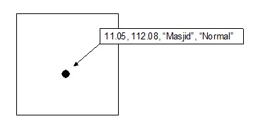
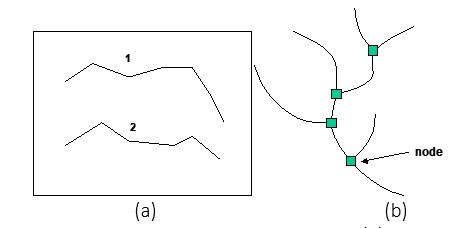
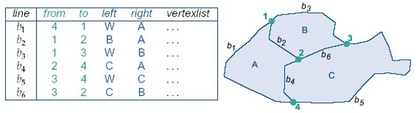
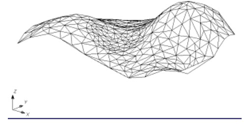
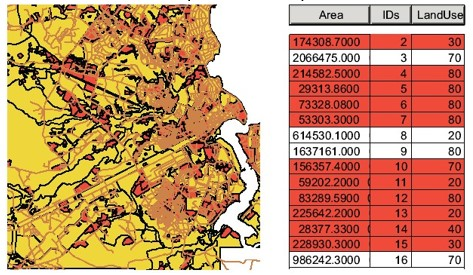
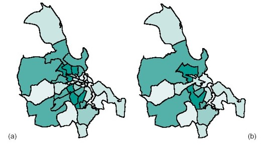
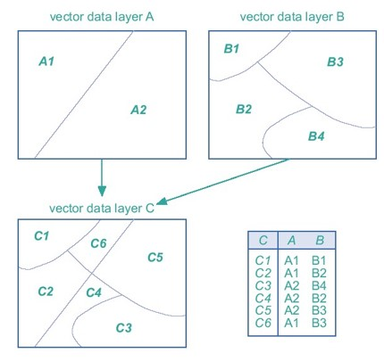
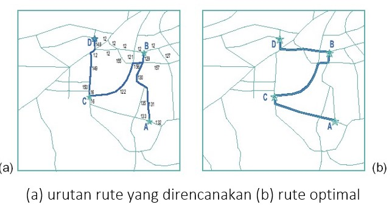
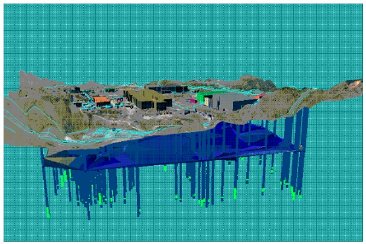

# Analisis Data Overlay

## Model Data Spasial Vektor dalam SIG

Model data vektor menampilkan, menempatkan dan menyimpan data spasial dengan menggunakan titik, garis atau poligon beserta atribut-atributnya. Bentuk-bentuk tersebut didefinisikan oleh sistem koordinat cartesian dua dimensi \(x,y\). Representasi vektor suatu obyek spasial merupakan suatu usaha menyajikan obyek sesempurna mungkin. Untuk itu, dimensi koordinat diasumsikan bersifat kontinyu \(tidak dikuantisasi sebagaimana pada model data raster\) yang memungkinkan semua posisi, panjang dan dimensi didefinisikan dengan presisi.

## Model Data Vektor Titik

Model data vektor titik meliputi semua obyek geografis yang dikaitkan dengan pasangan koordinat \(x,y\). Disamping informasi mengenai koordinat x,y, data-data yang diasosiasikan dengan titik harus disimpan guna menunjukkan jenis titik yang bersangkutan . Data-data tersebut dapat memuat informasi seperti ukuran tampilan dan orientasi simbol/titik tersebut. Gambar berikut menunjukkan contoh model data vektor titik degan asosiasi informasinya.

## Model Data Vektor Garis

Model data vektor garis didefinisikan sebagai semua unsur linear yang dibangun dengan menggunakan segmen-segmen garis yang dibentuk oleh dua titik koordinat atau lebih. Semakin pendek segmen-segmen garis, makin banyak jumlah pasangan-pasangan koordinat \(x,y\) dan makin halus bentuk kurva yang direpresentasikan. Korelasi antar data vektor garis yang menunjukkan informasi yang sama \(misal; pada jaringan sungai dan jalan\) diperlukan suatu simpul penghubung yang disebut dengan node. Gambar a menunjukkan model data vektor garis dengan data asosiasinya, sedangkan Gambar b menunjukkan model data vektor yang membentuk suatu jaringan.

## Model Data Vektor Poligon

Struktur model data poligon bertujuan untuk mendeskripsikan properties yang bersifat topologi dari suatu area \(bentuk, hubungan/relasi dan hirarki\) sedemikian rupa, hingga properties yang dimiliki oleh obyek spasial dapat ditampilkan dan dimanipulasi sebagai peta tematik. Model data vektor ini merupakan sekumpulan segmen garis yang membentuk kurva tertutup dan dicirikan dengan suatu nilai yang terdapat dalam seluruh luasan atau area kurva.

## Model Data Vektor TIN

TIN \(Triangulated Irregular Network\) adalah model data vektor yang berbasiskan topologi yang digunakan untuk mempresentasikan data permukaan bumi. TIN menyajikan model permukaan sebagai sekumpulan bidang-bidang kecil yang berbentuk segitiga yang saling terhubung. Informasi koordinat horizontal \(x,y\) dan vertikal \(z\) untuk setiap titik yang terdapat di dalam jaringan TIN \(yang kemudian dijadikan sebagai node\) dikodekan ke dalam bentuk-bentuk tabel.

## Analisis Spasial

Kemampuan SIG juga dikenali dari fungsi-fungsi analisis yang dapat dilakukan. Kemampuan analisis spasial menggunakan SIG dapat diklasifikasikan bermacam-macam. Klasifikasi di bawah ini mengacu pada Aronoff \(1989\):

1. Pengukuran, query spasial dan fungsi klasifikasi; 
2. Fungsi Overlay; 
3. Fungsi Neighbourhood; 
4. Fungsi Network;
5. Fungsi 3D Analyst.

## Pengukuran, Query Spasial dan Fungsi Klasifikasi

Fungsi ini merupakan fungsi yang meng-eksplore data tanpa membuat perubahan yang mendasar, dan biasanya dilakukan sebelum analisis data. Fungsi pengukuran mencakup pengukuran jarak suatu obyek, luas area baik itu 2 dimensi atau 3 dimensi.

Query spasial dalam mengidentifikasikan obyek secara selektif, definisi pengguna, maupun melalui kondisi logika. Contoh query spasial adalah misalnya Kita mencari suatu area yang kurang dari $$400.000 m^2$$ pada area peruntukan lahan \(Gambar a\). Fungsi klasifikasi adalah mengklasifikasikan kembali suatu data spasial \(atau atribut\) menjadi data spasial yang baru dengan menggunakan kriteria tertentu. Misalnya, klasifikasi pendapatan pertahun dari rumah tangga suatu daerah, dari kalsifikasi sebelumnya dibagi menjadi 7 kelas menjadi 5 kelas klasifikasi \(Gambar b\).

## Fungsi Overlay

Fungsi ini menghasilkan data spasial baru dari minimal dua data spasial yang menjadi dua data spasial yang menjadi masukannya. Sebagai contoh, bila untuk menghasilkan wilayah-wilayah yang sesuai untuk budidaya tertentu \(misalnya kelapa sawit\) diperlukan data ketinggian permukaan bumi, kadar air tanah, dan jenis tanah, maka fungsi analisis spasial overlay akan dilakukan terhadap ketiga data spasial \(dan atribut\) tersebut. Prinsip overlay dapat dilihat pada Gambar di bawah ini. Fungsi overlay ini juga dapat berlaku untuk model data raster.

Prinsip dasar overlay untuk poligon. Dua buah poligon layer A dan B akan menghasilkan data spasial baru \(dan atribut\) yang merupakan hasil interseksi dari A dan B.

## Fungsi Neighborhood

Salah satu yang terdapat dalam dalam klasifikasi adalah Buffering. Fungsi ini menghasilkan data spasial baru yang berbentuk poligon atau area dengan jarak tertentu dari data spasial yang menjadi masukannya. Data spasial titik akan menghasilkan data spasial baru yang berupa lingkaran-lingkaran yang mengelilingi titik-titik pusatnya. Untuk data spasial garis akan menghasilkan data spasial baru yang berupa poligon-poligon yang melingkupi garis-garis. Demikian pula untuk data spasial poligon berupa poligon-poligon yang lebih besar dan konsenris.

## Fungsi Network

Fungsi network merujuk data spasial titik-titik \(points\) atau garis-garis \(lines\) sebagai suatu jaringan yang tidak terpisahkan. Fungsi ini sering digunakan di dalam bidang-bidang transportasi, hidrologi dan utility \(misalnya, aplikasi jaringan kabel listrik, komunikasi, pipa minyak dan gas, air minum, saluran pembuangan\). Sebagai contoh dengan fungsi analisis spasial network, untuk menghitung jarak terderka antara dua titik tidak menggunakan jarak selisih absis dan ordinat titik awal dan titik akhirnya. Tetapi menggunakan cara lain yang terdapat dalam lingkup network. Pertama, cari seluruh kombinasi jalan-jalan \(segmen-segmen\) yang menghubungkan titik awal dan akhir yang dimaksud. Pada setiap kombinasi, hitung jarak titik awal dan akhir dengan mengakumulasikan jarak-jarak segmen yang membentuknya. Pilih jarak terpendek \(terkecil\) dari kombinasi-kombinasi yang ada. Salah satu aplikasi yang dapat diterapkan menggunakan fungsi network adalah mencari urutan rute yang optimal. Misalnya kita memiliki 3 tujuan yang harus di datangi. Dengan menghitung efektifitas dan efisien kita dapat menentukan rute optimal tujuan kita.

## Fungsi 3D Analyst

Fungsi 3 Dimensi terdiri dari sub-sub fungsi yang berhubungan dengan presentasi data spasial dalam ruang 3 dimensi. Fungsi analisis spasial ini banyak menggunakan fungsi interpolasi. Sebagai contoh, untuk menampilkan data spasial ketinggian, tata guna tanah, jaringan jalan dan utility dalam bentuk model  dimensi, fungsi ini banyak digunakan. Gambar berikut menyajikan contoh penggunaan fungsi 3D analyst untuk pengeboran sumur minyak.

