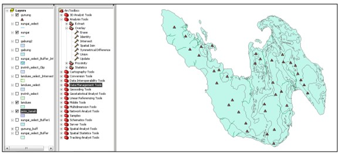

# Praktikum 2 - Analisis Data Spasial

Adapun langkah pelaksanaan dari praktikum ini antara lain sebagai berikut.

### Langkah 1

Bukalah software ArcMap.

Tambahkan layer jenis tanah, landuse, sungai, dan gunung \(sesuai data yang telah disediakan\).

### Langkah 2

Untuk menampilkan layer jenis tanah, landuse, dan sungai terukur dengan parameter yang telah ditentukan dapat dilakukan dengan cara **Analysis Tools** &gt; **Extract** &gt; **Select.**

#### Layer Jenis Tanah

Lalu memilih layer jenis tanah dan nama output. Setelah itu memilih Query Bulider dan mengisi perintah sesuai parameter yaitu **Jenis tanah = Ka**, seperti pada gambar di bawah ini.

--g

Akan muncul gambar seperti di bawah ini.

--g

#### Layer Landuse

Lalu memilih layer landuse dan nama output. Setelah itu memilih Query Bulider dan mengisi perintah sesuai parameter yaitu **Landuse = Hutan** atau Kebun Campuran, seperti pada gambar di bawah ini.

--g

Akan muncul gambar seperti di bawah ini.

--g

#### Layer Sungai Terukur

Lalu memilih layer sungai dan nama output. Setelah itu memilih Query Bulider dan mengisi perintah sesuai parameter yaitu Sungai = Sungai Terukur, seperti pada gambar di bawah ini.

--g

Akan muncul gambar seperti di bawah ini.

--g

### Langkah 3

Untuk menampilkan layer sungai terukur dan gunung dengan parameter yang telah ditentukan dapat dilakukan dengan cara **Analysis Tools** &gt; **Proximity** &gt; **Buffer**.

#### Layer Sungai Terukur

Lalu memilih layer sungai terukur \(sungai\_select\) dan nama output. Setelah itu mengisi nilai jarak buffer yaitu sejauh 549 m dan memilih tipe **dissolve all**. Seperti pada gambar di bawah ini.

--g

#### Layer Gunung

Lalu memilih layer gunung dan nama output. Setelah itu mengisi nilai jarak buffer yaitu sejauh 1549 m dan memilih tipe **dissolve all**. Seperti pada gambar di bawah ini.

--g

### Langkah 4

Untuk mengetahui lokasi perkebunan sawit dengan menggunakan jenis tanah, kelas landuse, dan  jarak dari sungai dapat menggunakan fungsi intersect. Langkah – langkahnya antara lain sebagai berikut.

**Analysis Tools** &gt; **Overlay** &gt; **Intersect**

--g

Lalu membuat nama dan lokasi output dan OK

Akan tetapi dikarenakan parameter gunung adalah lebih dari 1549 m, maka dibutuhkan fungsi analisis vektor yaitu Erase. Fungsi analisis ini untuk mengetahui daerah hasil intersect ketiga layer tadi \(jenis tanah, landuse, dan sungai terukur\) diluar area buffer gunung. **Analysis Tools** &gt; **Overlay** &gt; **Erase**.

--g

### Langkah 5

Langkah terakhir adalah menghitung luas dan keliling hasil analisa yang telah dilakukan. Menghitung luas dan keliling ini menggunakan fungsi Field Calculator dan Visual Basic Script. Pertama yang dilakukan adalah menambah 2 field baru yaitu Area dan Perimeter. **Klik kanan** layer hasil akhir &gt; **Open Atrribute Table** &gt; **Options** &gt; **Add Field**. Lalu mengisi seperti di bawah ini.

--g

Setelah field baru sudah terbentuk, pada nama field **klik kanan** &gt; **Field Calculator**, dan masukkan formula atau rumus seperti di bawah ini.

--g

Begitu juga dengan field perimeter atau keliling.

--g

Lalu OK, maka program akan menghitung luas dan keliling secara otomatis.  

### **Langkah 6: Analisis Layer Jenis Tanah**

Hasil dari analisis spasial menggunakan fungsi extract adalah sebagai berikut.

--g

Gambar di atas menunjukkan hasil dari fungsi extract dengan parameter jenis tanah adalah Ka. Hasil analisa di atas didapatkan menggunakan query builder ‘“KODE\_TANAH”’=’Ka’. Warna biru menunjukkan daerah atau layer jenis tanah secara keseluruhan, sedangkan warna hijau menunjukkan daerah dengan jenis tanah yang telah terseleksi \(Ka\).

### **Langkah 7: Analisis Layer Landuse**

Hasil dari analisis spasial menggunakan fungsi extract adalah sebagai berikut.

--g

Gambar di atas menunjukkan hasil dari fungsi extract dengan parameter kelas landuse atau tutupan lahan adalah hutan atau kebun campuran. Hasil analisis di atas didapatkan menggunakan query builder ‘“KLASLADUSE”’=’Hutan’OR ‘“KLASLADUSE”’=’Kebun Campuran’. Warna hijau menunjukkan daerah atau layer jenis tanah secara keseluruhan, sedangkan warna biru menunjukkan daerah dengan kelas tutupan lahan yang telah terseleksi \(kebun campuran atau hutan\).

### **Langkah 8: Analisis Layer Sungai**

Hasil dari analisis spasial menggunakan fungsi extract adalah sebagai berikut.

--g

Gambar di atas menunjukkan hasil dari fungsi extract dengan parameter sungai adalah sungai terukur. Hasil analisis di atas didapatkan menggunakan query builder ‘“Keterangan”’=’Sungai Terukur’. Selanjutnya hasil dari analisis pendekatan menggunakan buffer sebagai berikut.

--g

Gambar di atas menunjukkan hasil dari fungsi buffer dengan jarak 549 meter, terhadap sungai yeng telah terseleksi \(sungai terukur\). Dengan fungsi pendekatan buffer, dapat diketahui area sejauh 549 meter dari aliran sungai.

### **Langkah 9: Analisis Layer Gunung**

Hasil dari analisis spasial menggunakan fungsi extract adalah sebagai berikut.

--g

Gambar di atas menunjukkan hasil dari fungsi buffer dengan jarak 1549 meter, terhadap layer gunung. Dengan fungsi pendekatan buffer, dapat diketahui area sejauh 1549 meter dari aliran sungai. Dikarenakan parameter yang diwajibkan adalah lebih dari 1549 m, maka daerah yang dimkasud adalah diluar area buffer. Untuk mengetahui hasil daerah yang sesuai maka dilakukan proses analisa selanjutnya menggunakan fungsi erase.

### **Langkah 10: Hasil Analisis Gabungan**

Analisis spasial gabungan ini bertujuan untuk mengetahui hubungan antar keempat layer yaitu jenis tanah, kelas tutupan lahan, sungai, dan gunung yang diperuntukkan untuk mengetahui lokasi perkebunan kelapa sawit yang sesuai parameter yang telah ditentukan.  Berikut ini merupakan hasil analisa gabungan dari semua proses sebelumnya. Pada gambar pertama merupakan hasil analisa 3 layer \(jenis tanah, landuse, dan sungai\) ditampilkan dengan layer buffer gunung. Daerah yang berwarna biru dan berada di luar daerah buffer gunung merupakan daerah perkebunan kelapa sawit.

--g

Setelah dilakukan proses selanjutnya yaitu menggunakan fungsi Erase, maka didapatkan hasil area perkebunan kelapa sawit, seperti ditunjukkan pada gambar di bawah ini. Area perkebunan kelapa sawit ini mempunyai parameter jenis tanah Ka, kelas tutupan lahan hutan atau kebun campuran, berada pada jarak maksimum 549 m dari aliran sungai dan berada pada jarak ≥ 1549 m dari gunung.

--g

**Langkah 11: Hasil Perhitungan Luas dan Keliling**

Dari hasil perhitungan menggunakan field calculator \(VBA\), didapatkan luas dan keliling masing – masing poligon sebagai berikut.

--g

Hasil perhitungan luas dan keliling tiap poligon di atas didapatkan dari formula yang telah dilakukan di field calculator. Dengan menggunakan fungsi ini luas dan keliling akan otomatis terupdate, karena layer “hasil akhir” telah diubah menjadi **geodatabase feature class**.


Praktikum selesai.


## **Latihan**

Buatlah layout peta hasil analisis _query multi layer_ pada wilayah Kota Malang dengan mengombinasikan minimal 3 data.

