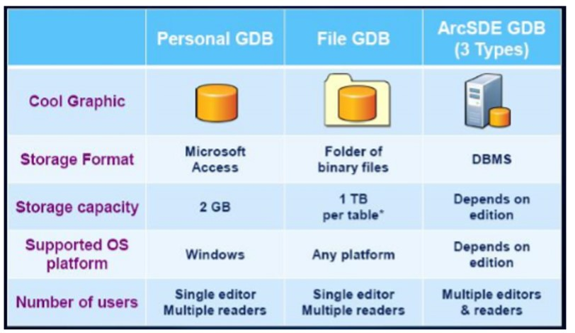

# Pengenalan Geodatabase

## Basis Data \(Database\)

Basis data \(database\) adalah sekumpulan logis dari informasi yang saling terkait yang dikelola dan disimpan sebagai satu kesatuan. Basis data GIS \(Geodatabase\) umumnya mencangkup lokasi spatial dan bentuk dari feature yang disimpan dalam bentuk titik, garis, polygon, pixel/grid/cell atau TIN \(Triangulated Irregular Network\) lengkap dengan data atributnya.

Dalam pengertian lain, database juga merupakan himpunan atau kumpulan data atau file yang saling berhubungan yang disimpan dalam satu media \(elektronik\) secara terorganisir, sehingga dapat diakses dengan mudah dan cepat. Jadi geodatabase merupakan database tentang data geografis. Agar database dapat diakses dengan mudah dan cepat, maka database yang dibuat harus mempunyai struktur basis data yang kompak, struktur table efisien dan sistematis, space \(memori\) penyimpanan yang kompak, ukuran table efisien untuk mempercepat proses pengolahan, sedikit/tidak ada pengulangan, dan tidak ada ambiguitas data dari semua table yang ada. Atau secara umum dapat disebut geodatabase \(database berbasis GIS\).

## Geodatabase

Geodatabase adalah suatu tempat yang digunakan untuk menyimpan data feature, dataset, raster dataset, topologi, network dataset, terrain dataset dan lain sebagainya. Ada tiga jenis geodatabase dalam ArcGIS seperti yang ditunjukkan pada gambar berikut.

1. Personal Geodatabase, semua dataset disimpan dalam format \*.mdb microsoft database dengan limit size sampai 2 Giga byte, hanya berjalan pada windows operating system. Dapat dipakai oleh single user dan kelompok kecil. Sering digunakan untuk manajemen data atribut melalui microsoft access untuk jenis atribut string \(teks\);
2. File Geodatabase, disimpan dalam bentuk sistem file, setiap dataset dapat disimpan sampai 1 Terra byte tetapi dapat dibesarkan mencapai 256 Terra byte untuk menyimpan data citra satelit yang besar dan banyak;
3. ArcSDE Geodatabase, dapat juga disebut dengan multiuser geodatabase, disimpan dalam bentuk relasional database menggunakan Microsoft SQL Server, IBM DB2, Oracle, PostgreSQL, IBM Informix. Syarat penggunaan jenis ini memerlukan ArcSDE sebagai penghubung dan tidak terbatas dalam penyimpanan serta penggunanya. Dapat digunakan pada platform windows, UNIX, Linux, dan koneksi langsung ke DBMS.

File Geodatabase dan Personal Geodatabase tersedia untuk semua pengguna ArcGIS Dekstop \(Basc, Standard, Advanced\) dirancang untuk mendukung model informasi pada geodatabase seperti topologi, raster katalog, network dataset, terrain dataset, address locator, dan lain-lain. Personal geodatabase didesain hanya dapat diedit oleh satu user saja, untuk file geodatabase dimungkinkan dapat diedit lebih dari satu editor pada waktu yang sama untuk feature yang berbeda. Perbedaan lainnya dapat dilihat pada gambar berikut ini.

Ada beberapa hal yang perlu diperhatikan dalam membuat geodatabase. Inventarisasi peta atau data spasial apa saja yang dibuat dan data atau feature class apa saja yang dibutuhkan, nantinya sangat berhubungan erat dengan populasi data dan juga analisa terhadap data yang akan digunakan.

### Penentuan sistem koordinat, skala dan toleransi yang akan digunakan

Klasifikasi feature dataset yang akan ditampilkan. Hal ini untuk meminimalkan feature class ganda yang terdapat pada feature dataset yang berbeda. Membuat desain awal geodatabase, yaitu berupa grafik aliran data, feature dataset sampai ke feature class untuk mengurangi kemungkinan kesalahan dalam pembuatan geodatabase dan untuk membuat geodatabase dengan data yang ramping dan efektif.

### Keunggulan geodatabase jika di bandingkan shapefile

Data dapat di klasifikasikan dalam populasi data tertentu, tanpa harus membuat folder dan file yang dibuat tidak terlalu banyak jadi sangat mudah untuk mengorganisasi dan mengaturnya. Geodatase dapat di gunakan untuk keperluan akses data baik secara intranet maupun internet karena bisa menggunakan beberapa software database seperti Oracle, SQL-Server, DB2 dan lain-lain. Untuk beberapa analisis tertentu di dalam ArcGIS hanya bisa di lakukan dengan geodatabase, tidak dapat dilakukan dengan shapefile seperti topology, cartographic representation, linear referencing dan lain-lain.

## Unsur-unsur Geodatabase

1. **Tabel**: menyimpan obyek non-spasial \(informasi tabular\), seperti table pemilik lahan, tabel jumlah penduduk, kepadatan penduduk, dsb. 
2. **Feature Class:** kumpulan dari obyek spasial: titik, garis, area \(poligon\). Bisa juga untuk menyimpan feature anotasi, dimensi, rute. 
3. **Feature Dataset:** tempat/wadah untuk feature class yang memiliki referensi spasial sama. Dataset ini perlu apabila kita ingin membuat network dan topologi. 
4. **Relationship classes**: mengatur hubungan tematik antara tabel, feature classes, atau kedua-duanya. Mendukung integrasi antara origin data dan destination class. 
5. **Geometrik Network**: hubungan topologi khusus antara titik dan garis yang digunakan untuk analisa pada alur sistem jaringan langsung. 
6. **Topologi:** hubungan spasial antara feature classes yang digunakan untuk menentukan dan memperbaiki kesalahan\(error\) spasial, seperti parcel yang overlap satu sama lain atau yang tidak berada dalam batas wilayah.
7. **Raster Dataset:** data grid yang diturunkan dari berbagai sumber format \(IMG,JPEG, dll\)
8. **Raster Catalog**: tabel dari kumpulan data raster
9. **Survey Dataset**: menyimpan informasi survey dan menggabungkan data survey dalam proyek dan banyak proyek ke dalam folder proyek.
10. **Toolboxes:** berisi tool-tool geoprocessing.
11. **Behaviour Rules:** dapat dibuat untuk mendefinisikan atribut legal,relation, topologi, koneksi.

