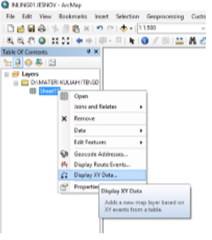
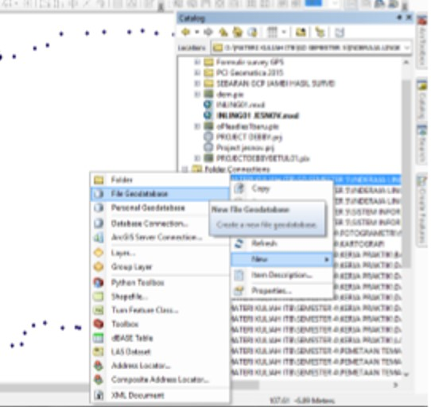
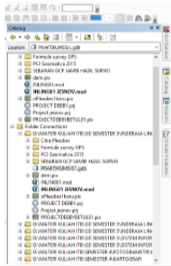
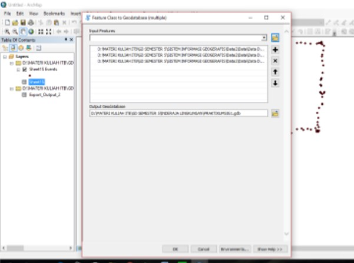

# Praktikum 1 - Implementasi Geodatabase

### Langkah 1

Tahap pertama yang dilakukan yaitu membuka program ArcGIS, kemudian akan muncul tampilan seperti pada gambar dibawah ini. Jendela kerja program ini terdiri dari Menu Bar, toolbox, tittle bar, status bar, dan space untuk menampilkan data yang sedang kita olah.

Setelah itu, untuk menambahkan data, klik icon Add Data pada toolbox seperti yang ditunjukkan pada gambar di bawah ini.

Setelah itu akan muncul kotak dialog box seperti pada gambar di bawah. Pada praktikum ini, akan dijelaskan bagaimana cara menambahkan suatu  data dengan menghubungkannya dengan suatu folder terlebih dahulu. Klik icon folder dengan tanda tambah untuk menghubungkan folder.

Setelah itu, akan tampak kotak dialog seperti pada gambar di bawah ini. Kemudian pilih folder yang akan dihubungkan dengan project yang akan kita kerjakan dan klik OK.

Setelah itu, klik isi nama Project dan klik OK.

### Langkah 2

Setelah terkoneksikan dengan folder yang kita inginkan, langkah selanjutnya adalah menginput file yang ingin ditampilkan. Pada praktikum kali ini, file yang diinput merupakan file yang berformat excel, kemudian klik pada file yang dimaksud dan pilih sheet seperti  pada gambar berikut, kemudian klik OK.

Setelah itu, akan muncul layer baru pada tabel of contents. Untuk menampilkan plottingan data dari tabel tersebut, klik kanan pada data yang diinginkan &gt; pilih display XY data seperti pada gambar di bawah ini.

Setelah itu akan muncul kotak dialog seperti pada gambar 10. Tentukan X,Y, dan Z field dengan kolom yang bersangkutan.  Lalu tentukan Sistem Koordinat yang akan digunakan dengan klik  Edit&gt; Pilih Jenis Koordinat \(Geogeraphic Coordinate System/ Projected Coordinate System \(pada contoh ini, Sistem Koordinat yang digunakan adalah Geogeraphic Coordinnate System\)&gt;WGS 1984&gt;OK.

Setelah itu akan muncul tampilan layar seperti pada gambar di bawah ini.

Untuk membuat shapefile klik kanan pada file yang dimaksud, pilih export data dan kemudian akan muncul kotak dialog seperti pada gambar berikut. Setelah itu, klik OK.

Setelah itu, akan muncul hasil plotting dari shapefile yang telah dibuat dan tampilan attribute table yang sebelumnya terdapat di Excel.

### Langkah 3

Setelah itu untuk membuat sebuah file geodatabase ikuti langkah-langkah berikut. Klik kanan pada folder yang akan digunakan sebagai tempat penyimpanan geodatabase&gt; New&gt; Geodatabae/ Personal Geodatabase. Namun pada praktikum ini, yang akan digunakan adalah file geodatabase.

Setelah itu, akan muncul icon file geodatabase baru kemudian input nama file yang diinginkan. Pada praktikum ini, praktikan menggunakan nama PRAKTIKUMSIG1.

Untuk membuat fitur feature dataset, klik kanan pada geodatabase yang diinginkan \(dalam  praktikum ini file geodatabse yang akan dibuat feature  dataset  adalah PRAKTIKUMSIG1.gdb\)&gt; New&gt; Feature dataset.

Setelah itu, akan muncul kotak dialog seperti pada gambar berikut ini. Input nama untuk Fitur  database&gt;Next&gt;Pilih sistem proyeksi yang ingin digunakan&gt;Next&gt;Finish.

### Langkah 4

Setelah feature class selesai dibuat, input feature class\(es\) dapat dilakukan dengan Klik kanan pada feature dataset yang akan dilakukan penginputan&gt; import &gt; Feat. Kemudian akan muncul kotak dialog seperti pada gambar di bawah.  Penginputan feature class dapat dilakukan dengan klik browse &gt; menuju folder penyimpanan file &gt; klik file &gt; add &gt;Ok.

Apabila proses penginputan feature class berhasil maka akan muncul tanda sebagai berikut.

Cara penginputan data pun dapat dilakukan dengan men-drag data yang diinginkan menuju jendela kerja ArcGIS. Setelah itu, akan muncul feature class seperti pada gambar di bawah ini.

### Analisis

Pada praktikum kali ini, hal pertama yang dilakukan adalah pengenalan mengenai program ArcGis beserta fitur-fitur yang terdapat di dalamnya. Setelah itu, dilanjutkan dengan pengenalan mengenai pengintegrasian data menggunakan geodatabase. Ada tiga jenis geodatabase dalam ArcGIS yaitu personal geodatabase, file geodatabase dan multiuser geodatabase. Pada praktikum ini, telah diberikan langkah-langkah untuk membuat sebuah file geodatabase hingga pembentukan feature data sets yang merupakan elemen dari database itu sendiri.

Pada praktikum kali ini, telah dijelaskan perbedaan antara personal geodatabase dan file geodatabase beserta kekurangan dan kelebihannya. Pembuatan geodatabase sendiri dilakukan agar mempermudah dalam pengintegrasian data dan pengelompokan data secara terstruktur,karena fasilitas fitur yang dimiliki oleh geodatabase sendiri yaitu, feature dataset yang digunakan untuk pengelompokan data feature class dengan sistem referensi koordinat yang sama, selain itu geodatabase mempermudah pada saat menampilkan data tersebut karena semua data sudah terbentuk menjadi satu kesatuan, sehingga efesiensi waktu dan mengurangi kemungkinan adanya data yang tidak terinputkan.


Praktikum 1 - Implementasi Geodatabase **Selesai**.


