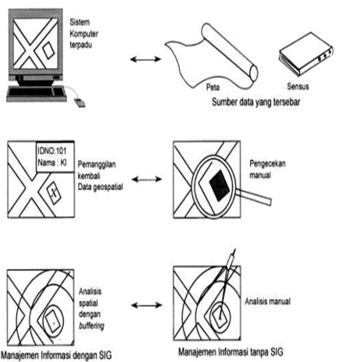

# Data Tekstual vs Data Spasial

Berikut ini ilustrasi perbedaan pekerjaan antara data tekstual dan data spasial:

### Perbandingan Tahapan Pekerjaan Menggunakan SIG dan Manual

| Tahapan | Menggunakan SIG | Pekerjaan Manual |
| :--- | :--- | :--- |
| Penyimpanan | Database digital dan terpadu | Skala dan standar berbeda |
| Pemanggilan kembali | Pencarian dengan komputer | Cek manual |
| Pemuktakhiran | Sistematis | Mahal dan memakan waktu |
| Analisis data atribut | Sangat cepat | Memakan waktu dan tenaga |
| Analisis data spasial | Mudah | Rumit |
| Penayangan | Murah dan cepat | Mahal |

