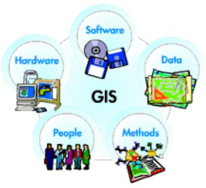

# Komponen SIG

Beberapa komponen penting pada SIG secara umum terdiri dari lima bagian, yaitu:

### Perangkat Keras \(_Hardware_\)

Komputer adalah salah perangkat keras yang bisa terdiri dari komputer tunggal, komputer sistem jaringan dengan server, komputer dengan jaringan global internet dan periperalnya. Proses yang berhubungan dengan perangkat keras diantaranya adalah pemasukan data, pemrosesan data, penyajian hasil, dan penyimpanan \(_storage_\).

### Perangkat Lunak \(_Software_\)

Perangkat lunak mempunyai fungsi untuk penyimpanan, analisis, dan penayangan informasi geografi. Persyaratan penting yang harus dipenuhi adalah _Database Management System_ \(DBMS\), fasilitas untuk pemasukan dan manipulasi data geografis, fasilitas untuk kueri, analisis, dan visualisasi, _Graphical User Interface_ \(GUI\) yang baik untuk mempermudah akses fasilitas yang ada.

### Data

Di bidang ilmu Komputer dan Informatika dikenal sistem bernama GIGO. Singkatan dari Garbage In, Garbage Out. Artinya, jika yang dimasukkan \(Input\) ke dalam sistem adalah data sampah, Maka data yang keluar pun \(output\) adalah sampah.

### Sumber Daya Manusia \(_People_\)

### Metode \(_Methods_\)

